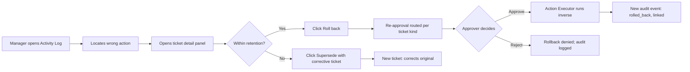

# Control Center

> **Type:** Blueprint · **Owner:** Product / CTO · **Status:** Approved · **Applies to:** All agents · All humans contributing code · **Jurisdiction:** Global · **Last reviewed:** 2026-05-17

## Summary

The **Control Center** is the single manager-facing surface that combines the [Unified Ticketing System](Unified-Ticketing-Blueprint), the immutable Activity Log, agent telemetry, the approval queue, and the Trust Score into one application. It is **where humans supervise the fleet of AI agents and human employees** — the only place a manager needs to look to answer *what is happening, who did it, why, and is it working*.

The Control Center is a **read model**. It owns no business state of its own. Every value it shows is sourced from the Ticket store, the Audit Event store, or the Telemetry store, all of which are owned by other substrates. That property is what makes the Control Center cheap to build, easy to replicate per-tenant, and trivially deployable under [managed-first or BYOC](Architecture-Principles).

> **The reframe this page makes:** rollback is not a department-specific design problem. It is a **ticket operation**. Because every state-changing action in Atlantis flows through a ticket ([Unified Ticketing § 1](Unified-Ticketing-Blueprint#1-what-ticket-means-in-atlantis)), reverting a wrong action is the same UX whether HR deactivated the wrong account, Finance posted a wrong journal entry, or Marketing pushed to the wrong segment. The Control Center is the surface that exposes that operation.

---

## 1. Why this page exists

A previous design impulse was to specify rollback semantics per-department — what "undo" means in HR vs. Finance vs. Legal. That approach does not scale: we cannot know every customer's department-specific business rules, and the surface area of "wrong actions a human or agent could take" is unbounded.

The Atlantis architecture has already collapsed this complexity at the substrate level:

- **Every state-changing action is a ticket** ([Unified Ticketing § 1](Unified-Ticketing-Blueprint#1-what-ticket-means-in-atlantis)).
- **Every ticket carries its inverse spec** so the Action Executor knows how to roll it back ([Rollback Procedures § 1](Rollback-Procedures#1-what-gets-snapshotted)).
- **Every ticket transition is an immutable Audit Event** ([Unified Entity Model § Audit Event](Unified-Entity-Model#audit-event)).

What was missing is the **single application that lets a manager exercise this power** — see the fleet, drill into a ticket, click rollback, supervise the approval queue, evaluate trust, and ratchet autonomy. That application is the Control Center.

This page unifies what was previously distributed across [Unified Ticketing § 13 (console)](Unified-Ticketing-Blueprint#13-the-customer-facing-console), [Approval Workflow Framework](Approval-Workflow-Framework), [Phased Autonomy Reference](Phased-Autonomy-Reference), [Observability Standards](Observability-Standards), and [Product Requirements § F](Product-Requirements). Nothing here is invented from scratch; this page is the **architectural integration** of the existing pieces, and the **specification gap-fill** for the Trust Score Dashboard (previously referenced but never specified — see § 5).

---

## 2. Who the Control Center is for

The Control Center serves **two primary personas** with role-based defaults and shared mechanics. A user only sees what their permissions allow ([§ 8](#8-permissions-and-rbac)).

### 2.1 Department Manager (most users; daily driver)

A mid-level manager supervising one department's agents and humans. Examples: Head of Support, VP Finance, HR Director, Sales Manager.

**Default landing: Department View** — every ticket in their department, filtered to the manager's active queue. Their day looks like:

- Approve or reject ticketed actions awaiting their sign-off.
- Investigate anomalies surfaced by alerts (SLA breach, gate failure spike, override surge).
- Roll back wrong actions inside their department within retention.
- Review their department's Trust Score trends weekly.

The department manager does **not** see other departments' tickets unless an entity (e.g. Acme Corp) crosses departmental lines and they have explicit `cross_dept_read` permission.

### 2.2 Customer Admin / COO (executive lens)

A cross-department executive. Examples: COO, CIO, Chief of Staff, CEO of a smaller customer.

**Default landing: Fleet View** — the live grid of every agent and human across every department, with rolled-up metrics. Their day looks like:

- Scan the fleet for anything red (incidents, SLA breaches, runaway costs, autonomy auto-rollbacks).
- Approve cross-department sagas (hire-to-onboard, vendor activation, contract-to-cash).
- Decide autonomy phase progressions based on Trust Score evidence.
- Issue emergency controls when needed (pause an agent, mass-rollback a window — § 6).

Both personas use the same five pillars below; only the default lens and the permission set differ.

---

## 3. The five pillars

The Control Center is composed of five integrated surfaces. Each pillar reads from one or more existing substrates; **no pillar owns its own system of record**.

```
┌──────────────────────── CONTROL CENTER ─────────────────────────┐
│                                                                  │
│  1. FLEET VIEW           live grid of all agents & humans        │
│                          → reads: Telemetry + Ticket store       │
│                                                                  │
│  2. TICKET LEDGER        My Work / Dept / Entity views           │
│                          → reads: Ticket store + CRM graph       │
│                                                                  │
│  3. ACTIVITY LOG         immutable who-did-what-when             │
│                          → reads: Audit Event store              │
│                                                                  │
│  4. APPROVAL QUEUE       manager's inbox of pending actions      │
│                          → reads: Approval Queue (Ticket store)  │
│                                                                  │
│  5. TRUST SCORE          per-agent performance & autonomy gate   │
│                          → reads: Audit + Telemetry + Tickets    │
│                                                                  │
└──────────────────────────────────────────────────────────────────┘
```

### 3.1 Fleet View

The live grid view of every agent (AI) and every human contributor on the platform.

**Columns shown per row:**

| Column | Source |
|---|---|
| Actor name + kind (`agent` / `human`) | Identity |
| Department | Identity |
| Current state (`idle` / `working` / `awaiting_human` / `blocked` / `paused` / `quarantined`) | Telemetry + Ticket store |
| Active ticket ID + kind + entity | Ticket store |
| Queue depth (tickets pending pickup) | Ticket store |
| Trust Score (agents only) | § 5 |
| Cost-so-far today | [FinOps](FinOps-Strategy) |
| Last action timestamp | Audit |

**Row actions:**

- **Inspect** — drill into the actor's recent activity (Activity Log filtered).
- **Pause** — halts new ticket assignments to this actor (customer admin only; § 6).
- **Trust Score drilldown** — opens § 5 detail panel.

**Refresh cadence:** state column updates within 5 seconds of a backend event; metrics columns refresh on the 60-second tick.

**Roll-ups:** the Fleet View aggregates per-department counts (active tickets, awaiting-approval count, SLA-breaching count). Customer admin lands here by default; department managers see only their department.

### 3.2 Ticket Ledger

The reader for the [Unified Ticketing](Unified-Ticketing-Blueprint) substrate. Already specified at [Unified Ticketing § 13](Unified-Ticketing-Blueprint#13-the-customer-facing-console); this section enumerates the views without restating their schema.

| View | Purpose | Persona default |
|---|---|---|
| **My Work** | Tickets assigned to me, or awaiting my approval | Every logged-in user |
| **Department View** | Tickets in my department, filterable | Department manager landing |
| **Entity View** | Tickets related to a given entity (Acme Corp, Sarah Chen, Q3 campaign) | Used for investigation |
| **Saga View** | Parent ticket + child ticket tree for cross-department workflows | Used for cross-dept investigation |

Every ticket card supports: open, comment, re-assign, **cancel** (pre-execution), **rollback** (post-execution, § 4), and **link corrective ticket** (after the retention window has closed and rollback is not eligible).

### 3.3 Activity Log

The reader for the immutable Audit Event store. Append-only, retention per [Rollback Procedures § 2](Rollback-Procedures#2-retention).

**Default filters:**

- Time window: last 24h (managers), last 7d (customer admin)
- Actor: any agent, any human, or `all`
- Action class: `Read` / `Write` / `External` / `Financial` / `Delete`
- Outcome: `committed` / `rolled_back` / `rejected` / `gate_failed`

**Per-row drilldown shows:**

- The full pre- and post-state diff (Write/Delete classes)
- The reverse-call spec the platform would use to roll it back
- The full chain of audit events linked to this ticket (state transitions, approvals, gate results)
- The validation gate results, including any failures
- The originating signal that started the ticket (which user, which scheduled job, which inbound event)

**Compliance export:** any Activity Log query can be exported as a signed, timestamped artifact suitable for SOC 2 / ISO 27001 / GDPR audit response ([Unified Ticketing § 12](Unified-Ticketing-Blueprint#12-audit-trail)).

### 3.4 Approval Queue

The reader for the human approval flow specified in [Approval Workflow Framework](Approval-Workflow-Framework). Every approval-gated action surfaces here for the routed approver.

**Each queue item shows:**

- Ticket summary (one line)
- Proposed action and risk class
- The **escalation packet** — confidence score, top uncertainty factors, sources consulted, recommended next step ([Approval Workflow Framework § 4](Approval-Workflow-Framework))
- A diff view of what the action would change
- Buttons: `approve` / `approve_with_edits` / `reject` / `defer`

**Bulk approval** is supported for low-risk, high-volume work (e.g. tag 200 leads). The approver reviews the template + a 5-sample preview, then approves the batch with one decision recorded against each ticket.

**Auto-escalation:** items past their `escalation_after` SLA route to the next tier automatically; the queue reflects this with a visible "escalated to {{role}}" badge.

### 3.5 Trust Score

The aggregate per-agent performance signal. The strategic argument for this surface is in [Strategic Considerations § "The Trust Score is the sales tool"](Strategic-Considerations#the-trust-score-is-the-sales-tool); the **specification** is in § 5 below.

The Trust Score view shows: current score, 90-day trend, contributing-input breakdown, the autonomy phase the score qualifies the agent for, and the evidence chain for the most recent phase progression.

---

## 4. Rollback as a ticket operation

This section is the architectural answer to the question *"how does a department user roll back a wrong action when we don't know their domain?"*

We do not need to know their domain. We know how to manipulate tickets.

### 4.1 The five rollback verbs

Every ticket supports the same five operations from the Control Center, regardless of which department it belongs to:

| Verb | When applicable | What it does |
|---|---|---|
| **Cancel** | Ticket state in `open`, `in_progress`, `awaiting_approval`, `blocked` | Transitions to `closed_rejected`. No state in the world changed yet, so nothing to undo. |
| **Reject** | Ticket state `awaiting_approval` | Same as cancel from an approver's seat; records rejection rationale. |
| **Roll back** | Ticket state `closed_resolved`, within retention window | Executes the ticket's inverse spec via the Action Executor. Produces a new audit event linked to the original. |
| **Supersede** | Ticket state `closed_resolved`, past retention or for partially-reversible actions | Creates a new corrective ticket with `corrects: <original-ticket-id>`. The original stays; the audit chain shows the correction. |
| **Saga rollback** | Parent ticket | Cancels pending children, rolls back committed children in reverse order ([Rollback Procedures § 6](Rollback-Procedures#6-workflow-level-rollback)). |

None of these operations need department-specific code. The Action Executor reads the ticket's pre-state snapshot and reverse-call spec, runs the inverse, and emits the audit event. Domain-specific concerns (which manager re-approves, what business policy applies) are encoded in the ticket's **kind**, which routes the rollback through the standard [Approval Workflow Framework](Approval-Workflow-Framework).

### 4.2 The rollback flow



The manager experiences the same five-step UX regardless of whether they are rolling back an HR account deactivation, a Finance journal entry, a Marketing email send (which becomes a retraction draft), or a Legal hold application.

### 4.3 Honest limits surfaced in the UI

For actions that cannot be technically reversed ([Rollback Procedures § 5](Rollback-Procedures#5-irreversibility--what-we-honestly-cannot-rollback)), the Control Center renders the rollback button with a **modified label** and a tooltip explaining what will happen:

| Action class | Button label | What rollback actually executes |
|---|---|---|
| Email already sent | `Issue retraction` | Drafts a retraction email queued for approval |
| Stripe charge cleared | `Issue refund` | Creates a `refund` ticket, full Financial approval path |
| Public social post | `Delete + retract` | Attempts deletion; drafts a retraction post |
| External webhook fired | `Send compensation` | Drafts a compensating call if the service supports one |
| Legal hold applied | (disabled) | Rollback refused; must lift the hold separately |

This is the platform being honest about its limits at the surface where humans make decisions, instead of pretending all actions are reversible.

---

## 5. Trust Score specification

The Trust Score is referenced in [Phased Autonomy Reference](Phased-Autonomy-Reference) (as a phase progression gate), [Strategic Considerations](Strategic-Considerations#the-trust-score-is-the-sales-tool) (as the primary expansion sales tool), and [Unified Ticketing § 10](Unified-Ticketing-Blueprint#10-phased-autonomy-applied-to-tickets), but has never been formally specified. This section fills that gap.

### 5.1 Definition

The Trust Score is a continuous value in `[0.00, 1.00]`, computed **per agent per ticket kind**, updated daily, and persisted as a time series. The score answers one question: *based on the last 90 days of evidence, how often does this agent do the right thing on this kind of work without a human having to correct it?*

The Trust Score is **not** a model confidence score (that is per-action; see [Confidence and Escalation Rules](Confidence-and-Escalation-Rules)). The Trust Score is a **rolled-up behavioural signal** computed from ticket outcomes.

### 5.2 Inputs

For an agent `A` and ticket kind `K` over a rolling 90-day window, the Trust Score is composed of five weighted inputs:

| Input | Weight | Definition | Source |
|---|---|---|---|
| **Accuracy rate** | 0.35 | `closed_resolved_without_rollback / total_closed_resolved` | Audit + Ticket store |
| **Human-override rate** (inverse) | 0.25 | `1 − approve_with_edits / total_approvals` | Approval Queue history |
| **Validation gate pass rate** | 0.20 | `gate_passes / (gate_passes + gate_failures)` | Validation gate events |
| **SLA adherence** | 0.10 | `resolved_within_due_at / total_closed_resolved` | Ticket store |
| **Escalation rate** (inverse) | 0.10 | `1 − escalations_to_higher_tier / total_decisions` | Approval Queue history |

Each input is normalised to `[0, 1]` before weighting. The composite is:

```
trust_score(A, K) = 0.35·accuracy + 0.25·(1−override) + 0.20·gate_pass + 0.10·sla + 0.10·(1−escalation)
```

### 5.3 Cohorts and de-biasing

A naïve average gives misleading results when ticket volume is low or skewed. Two rules apply:

- **Minimum cohort:** a Trust Score requires at least **30 closed tickets** of the given kind in the 90-day window. Below that, the score renders as `insufficient_data` and **never satisfies an autonomy phase gate**.
- **Confidence interval:** every Trust Score is published with a 90% confidence interval (Wilson score). The phase-progression gate uses the lower bound, not the point estimate — preventing a small cohort with one lucky streak from auto-ratcheting autonomy.

### 5.4 How the score gates autonomy

The Phased Autonomy Reference specifies score thresholds per phase ([Phased-Autonomy-Reference.md:30](wiki/Phased-Autonomy-Reference.md:30), [:52](wiki/Phased-Autonomy-Reference.md:52), [:74](wiki/Phased-Autonomy-Reference.md:74), [:91](wiki/Phased-Autonomy-Reference.md:91)):

| Target phase | Required `trust_score(A, K)` (lower bound) | Other gates |
|---|---|---|
| Phase 2 (Startup) | ≥ 0.80 | 30 days in phase, override < 25% |
| Phase 3 (Approval) | ≥ 0.90 | 60 days in phase, override < 15%, zero critical gate failures |
| Phase 4 (Enterprise) | ≥ 0.95 sustained for 30 consecutive days | 90 days in phase, override < 5%, exec sponsor approval |

**Auto-rollback:** if the score drops below `0.92` for **48 consecutive hours** in Phase 4 (or below the equivalent floor for the current phase), the agent is auto-demoted to the prior phase and the customer admin is paged. This is the failsafe specified in [Phased Autonomy § Auto-rollback](Phased-Autonomy-Reference#auto-rollback-conditions).

### 5.5 What is shown in the Control Center

The Trust Score panel for an agent shows:

- **Headline score per ticket kind**, with confidence interval and 90-day sparkline.
- **Input breakdown** — the five contributing inputs with their current values.
- **Phase eligibility** — "this agent qualifies for Phase 3 in `lead_qualification` (current: Phase 2); evidence: 60 days, score 0.91 ±0.03, override 12%".
- **Recent regressions** — any input that dropped >10% week-over-week, with links to the tickets that drove the drop.

This is the boardroom-ready artifact referenced in [Strategic Considerations](Strategic-Considerations#the-trust-score-is-the-sales-tool). It is what the customer's CIO sees on login.

---

## 6. Emergency controls (customer admin only)

For incident response, the customer admin has four emergency operations available in the Control Center. These are deliberately concentrated at the admin role — they are blast-radius operations.

| Control | Effect | Audit consequence |
|---|---|---|
| **Pause agent** | Halts new ticket assignments to the named agent; in-flight tickets continue to completion or `blocked` | Single audit event with rationale required |
| **Pause department** | Halts new ticket assignments across an entire department's agents | One audit event per agent affected |
| **Emergency revert window** | Rolls back every action by a named agent (or all agents) within a time window | Per-action audit events; flagged as `emergency_revert` for compliance review |
| **Quarantine agent** | Pauses + revokes all credentials + opens a `gate_failure_review` parent ticket for forensics | Single audit event; pages Security on-call |

All four require a typed rationale, a second-admin confirmation for `emergency_revert` and `quarantine`, and produce an immediate notification to the platform's Customer Success Manager. See [Incident Response Playbook](Incident-Response-Playbook) for when each is appropriate.

These controls are **never available to a department manager**. A department manager can pause an *individual ticket* (cancel), but cannot pause an *agent identity*.

---

## 7. What the Control Center does NOT own

The Control Center is a read model. It does not own:

- **Tickets** — owned by the [Unified Ticketing System](Unified-Ticketing-Blueprint).
- **Audit Events** — owned by the Audit Engine (append-only store; [Observability Standards § 10](Observability-Standards)).
- **Metrics and telemetry** — owned by the observability stack ([Observability Standards](Observability-Standards)).
- **Approval routing rules** — owned by the [Approval Workflow Framework](Approval-Workflow-Framework).
- **Action execution** — owned by the [Action Executor](Cross-Agent-Coordination#3-the-action-executor).
- **Identity, RBAC, and tenant boundaries** — owned by the platform identity service.

This separation is what lets the Control Center scale: it is stateless, horizontally replicable, and can be regenerated from the substrates at any time without data loss. It is also what lets the Control Center deploy under BYOC — only the read-projection service needs to run inside the customer's environment; the underlying substrates live wherever the customer's deployment topology puts them.

---

## 8. Permissions and RBAC

The Control Center is a consumer of the platform's unified identity model, specified in full in [Identity and Access Control](Identity-and-Access-Control). That page defines: the Actor abstraction (Person, Agent, Service share the same shape), the Agent entity (every agent has a name, title, department, and named human manager), the Role object schema, the canonical permission registry, the asymmetry that agents cannot approve, and the lifecycle of agent provisioning, rotation, and deprovisioning.

The Control Center ships with the three default human role bundles inherited from that page:

| Role | Default scope | What they see | What they can do |
|---|---|---|---|
| **Employee** | Self | My Work view; tickets they originated or are assigned to | Comment, complete assigned work, request approval |
| **Department Manager** | One department | Department View, Activity Log filtered to dept, Approval Queue (dept), Trust Score (dept agents) | Approve/reject, cancel, roll back within retention, supersede |
| **Customer Admin** | All departments | Fleet View, full Activity Log, all Approval Queues, all Trust Scores, all emergency controls | All of the above + pause/quarantine agents + emergency revert window |

Custom roles for tenant-specific organisational fit live in the platform IAM database; see [Identity and Access Control § 8](Identity-and-Access-Control#8-custom-roles-tenant-specific-in-the-iam-database) for the creation and assignment flows.

**Key permission rules enforced in the Control Center UI:**

- A manager **cannot approve a ticket they originated as a human** ([Approval Workflow Framework § 9](Approval-Workflow-Framework#9-approval-impersonation)). Enforced at the API gateway, surfaced in the UI as a greyed-out button with a tooltip.
- A manager **cannot roll back a ticket whose `corrects` chain includes a ticket outside their department** without `ticket.rollback.tenant` permission, even if they originated the latest correction.
- Read-only access to the Activity Log is broadly available (every employee can read tickets they are related to via the entity graph), but compliance-export-grade signed bundles require `compliance.export.signed` permission.
- The Trust Score panel is visible to department managers for their own department's agents, and to customer admins for all agents. It is **not** visible to non-managers (a Trust Score below a tenant-configurable threshold could be sensitive).
- **Agents cannot be approvers.** This is hard-coded across the platform per [Identity and Access Control § 6](Identity-and-Access-Control#6-the-asymmetry-that-stays). The Control Center never routes an approval to a Role with `applies_to: agent`.

---

## 9. Performance envelope

The Control Center's reads must feel instant — a manager scanning the Fleet View shouldn't wait. Targets feed the [SLOs in Observability Standards](Observability-Standards#2-service-level-objectives-slos).

| Operation | p50 | p95 | p99 |
|---|---|---|---|
| Fleet View initial render (50 actors) | < 200ms | < 600ms | < 1.5s |
| Fleet View live update (single row) | < 100ms | < 300ms | < 800ms |
| Ticket Ledger page load (100 tickets) | < 250ms | < 700ms | < 1.5s |
| Activity Log query (24h window, single actor) | < 300ms | < 900ms | < 2s |
| Trust Score panel load (1 agent × all kinds) | < 400ms | < 1.2s | < 3s |
| Compliance export job (1 quarter, all actors) | async — job result < 5 min | < 15 min | < 30 min |

These targets are achievable because the Control Center reads from precomputed projections, not from the live transactional stores. Projection lag is monitored and must not exceed **30 seconds** for the Fleet View state column (or the column renders a "stale" badge).

---

## 10. Phasing

The Control Center is built in three phases aligned to the [Build Roadmap](Build-Roadmap).

| Phase | What ships | Why this slicing |
|---|---|---|
| **Phase 1** (Core Infra) | Ticket Ledger (My Work, Department, Entity) + Activity Log + Approval Queue | These three pillars are non-negotiable — no production traffic without them. |
| **Phase 2** (Department Agents) | Fleet View + per-agent inspect + Pause agent | The fleet only becomes interesting once multiple agents are running. |
| **Phase 3** (Trust Ramp) | Trust Score panel + autonomy gating UI + emergency revert window + quarantine | Trust Score requires a 90-day data history before it's meaningful. |

The Saga View, compliance export wizard, and cross-dept rollback UI are continuous improvements within Phase 2–3, not gating capabilities.

---

## 11. Forbidden

- **Bypassing the substrate boundary.** The Control Center must not own or persist business state. If a workflow needs new state, extend the underlying substrate, not the Control Center.
- **Silent rollback.** Every rollback initiated from the Control Center must produce an audit event with rationale and approver identity. No "click and forget."
- **Cross-tenant data leak.** Every query in the Control Center carries the tenant scope; a department manager at Customer A must never see Customer B's data. Enforced at the API gateway.
- **Originator approves own action.** Already forbidden by [Approval Workflow Framework § 9](Approval-Workflow-Framework#9-approval-impersonation); the Control Center UI must enforce this by disabling the button, not relying solely on backend rejection.
- **Mass operations without rationale.** Bulk approval, bulk close, and emergency revert each require a typed rationale captured into the audit log.
- **Trust Score gaming.** The Trust Score must not be editable by humans. A customer admin can dispute a Trust Score (which opens a `gate_failure_review` ticket), but cannot directly adjust the value.
- **Department manager seeing other departments by default.** Cross-department visibility requires explicit `cross_dept_read` permission, granted per-entity or per-saga, not blanket.

---

## 12. When to revisit

- A class of customer incidents traces to a missing Control Center surface (e.g. "we couldn't tell what was happening before the audit log query finished") — promote the surface from ad-hoc to first-class.
- The Trust Score formula produces frequent disputes — re-examine input weights or de-biasing rules; review with the [Domain Expert Councils](Domain-Knowledge-Index).
- Bulk approval is used for any kind where override rate exceeds 5% — that kind should not be bulk-approvable; tighten the eligible-kind list.
- Cross-department rollback frequency exceeds 1% of all rollbacks — likely indicates a saga boundary problem; revisit the parent/child design for that workflow.
- An eighth or ninth department is added — re-evaluate Fleet View column density and Department View pagination defaults.
- BYOC deployment surfaces latency above the p95 target — re-examine the projection refresh cadence and per-region read-replica topology.

CTO is the accountable owner of the Control Center surface. Product owns the manager-experience design. Engineering owns the read-projection service. Each Domain Expert Council owns the Trust Score formula calibration for its department's ticket kinds.

---

## Cross-references

- [Unified Ticketing Blueprint](Unified-Ticketing-Blueprint) — the work substrate the Control Center reads
- [Unified Entity Model § Audit Event](Unified-Entity-Model#audit-event) — the audit event schema
- [Approval Workflow Framework](Approval-Workflow-Framework) — the approval queue's routing and escalation logic
- [Phased Autonomy Reference](Phased-Autonomy-Reference) — the autonomy phases the Trust Score gates
- [Confidence and Escalation Rules](Confidence-and-Escalation-Rules) — per-action confidence (distinct from Trust Score)
- [Rollback Procedures](Rollback-Procedures) — what rollback executes under the hood
- [Cross-Agent Coordination](Cross-Agent-Coordination) — the Action Executor that runs the inverse calls
- [Observability Standards](Observability-Standards) — the telemetry the Fleet View reads
- [Action Risk Classification](Action-Risk-Classification) — the action classes shown in the Activity Log
- [Strategic Considerations § "The Trust Score is the sales tool"](Strategic-Considerations#the-trust-score-is-the-sales-tool) — why this surface matters commercially
- [Incident Response Playbook](Incident-Response-Playbook) — when emergency controls are appropriate
- [Product Requirements § F — Agent Management Console](Product-Requirements) — the original requirements line this page expands
- [Master Blueprint Index](Master-Blueprint-Index)
