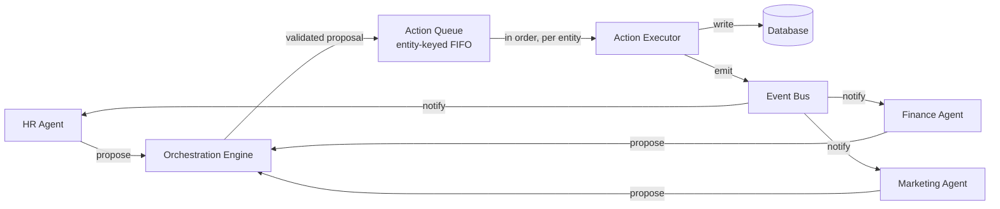
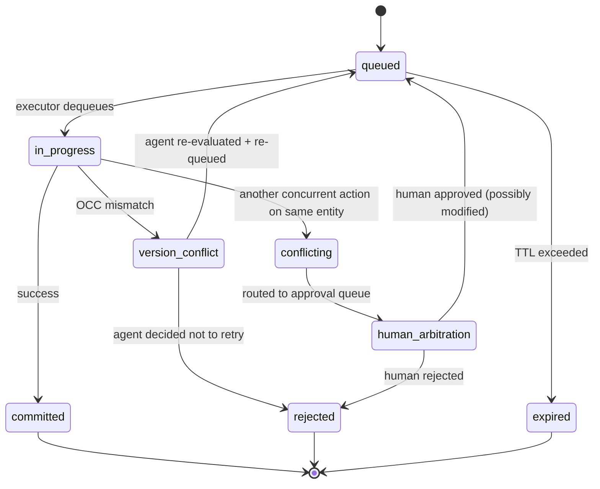
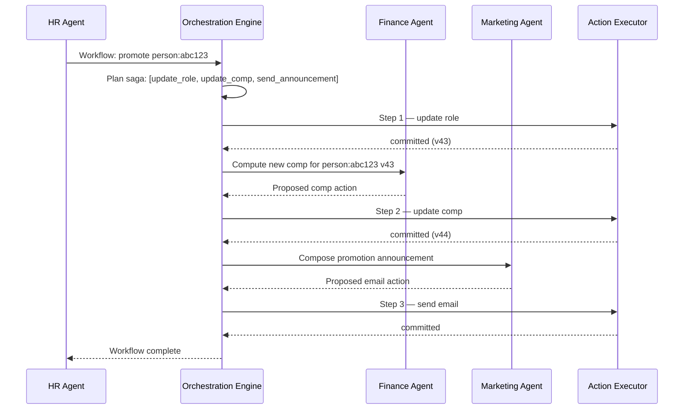

# Cross-Agent Coordination

> **Type:** Rule · **Owner:** Engineering · **Status:** Approved · **Applies to:** All agents · All humans contributing code · **Jurisdiction:** Global · **Last reviewed:** 2026-05-15

## Summary

When multiple agents need to read, modify, or delete the same entity — a user profile, a transaction, a project record — the platform must prevent contradictory state, race conditions, parallel-write conflicts, and lost updates. This page is the **authoritative architectural pattern** for cross-agent coordination on backend tasks.

The principle: **agents propose, executors act.** Agents never touch the database directly. Every mutation flows through an entity-keyed action queue processed by the **Action Executor**, which serialises writes, applies optimistic concurrency control, and emits events so other agents can react to new state.

This page operationalises three things that earlier pages reference but did not fully specify:

- The [Orchestration Engine](Product-Requirements#b-orchestration-engine--shared-core-solves-b6) — central broker for cross-department coordination
- The [Deterministic Execution Wrapper](Validation-Gate-Specifications#4-deterministic-execution-wrapper) — the rule that LLMs decide *what*, code executes *how*
- The [Workflow state machine](Product-Requirements#b-orchestration-engine--shared-core-solves-b6) — the formal status of every multi-step workflow

---

## 1. The problem we solve

Three concrete scenarios any enterprise AI platform must handle correctly:

**Scenario A — concurrent edits.** Two agents want to modify the same employee record at the same time. HR Agent proposes "promote to Staff Engineer"; Finance Agent proposes "update compensation band". Without coordination → lost update or contradictory state.

**Scenario B — delete vs. pending operation.** HR Agent proposes "terminate employee `person:abc123`". At the same moment, Finance Agent has a pending payroll action against the same employee. Without coordination → the termination commits, the payroll fails, the employee is owed money and there is no trace of why.

**Scenario C — multi-entity workflow.** A promotion workflow needs to: update the role (HR), update compensation (Finance), send the announcement email (Marketing). All three must succeed together or none of them does. Without coordination → partial state where role changed but compensation didn't.

Every one of these is a customer-visible incident if mishandled. The architecture below makes each handle-able by construction.

---

## 2. The principle: agents propose, executors act

**Agents never call a write API directly.** This is enforced at the API gateway — agent OAuth scopes do not include direct write capability to entity tables. The only identity with that scope is the **Action Executor**.

This is the same principle as the [Deterministic Execution Wrapper § 4](Validation-Gate-Specifications#4-deterministic-execution-wrapper) — extended here with the **serialization, concurrency, and conflict-resolution** machinery that makes it work across multiple agents on the same data.



The flow is: **agent reasoning → validation gates → action queue → action executor → database + event bus → agents subscribed to that entity react**.

---

## 3. The Action Executor

A dedicated platform service. It is the only identity with write scopes to entity tables. Its job is narrow and unglamorous:

1. **Dequeue** the next action for an entity (FIFO).
2. **Verify** the action is still valid (version match, lease check, dependency check).
3. **Apply** the mutation inside a database transaction.
4. **Snapshot** the pre-state for [Rollback Procedures](Rollback-Procedures).
5. **Commit** the transaction.
6. **Emit** the state-change event.
7. **Acknowledge** the action back to the originating agent + orchestration engine.

The executor does **no reasoning**. It does not interpret intent. It does not call LLMs. It is deterministic code, exhaustively tested, monitored by the [four golden signals](Observability-Standards#1-the-four-golden-signals).

In our [Technology Stack](Technology-Stack), the executor is a Go service — it is on the latency-sensitive hot path, and the throughput is high enough that Go's performance advantage materially helps.

---

## 4. Entity-keyed serialization

Mutations to the **same entity** are serialised through a per-entity FIFO queue. Mutations to **different entities** run in parallel.

```
Queue for entity employee:abc123:  [action1, action2, action3]   ← serial
Queue for entity employee:xyz789:  [action4, action5]            ← serial
Queue for entity txn:def456:       [action6]                     ← serial
... all queues processed in parallel
```

The entity ID is the partition key in the underlying queue (NATS JetStream subject pattern: `actions.<entity_kind>.<entity_id>`). This gives strict ordering per entity without globally serialising the entire platform.

For workflows touching multiple entities, see [Section 7 — Saga pattern](#7-saga-pattern-for-cross-entity-workflows).

---

## 5. Optimistic Concurrency Control (OCC)

Every mutable entity has a monotonically-increasing `version` integer.

When an agent reads an entity, it reads `version`. When it proposes an action, the proposal carries `expected_version`. When the executor dequeues the action, it checks:

```
if entity.current_version != action.expected_version:
    REJECT with current state → routed back to agent's escalation logic
else:
    APPLY, increment version, commit, emit
```

This is the classic OCC pattern. It catches the case where:

- Agent A reads version 42, proposes change X.
- Agent B reads version 42, proposes change Y.
- A's action lands first → version 43.
- B's action arrives expecting 42 → rejected.
- B's escalation logic re-reads the entity (now at 43), evaluates whether change Y still makes sense given X already landed, and either re-proposes or escalates to a human.

OCC is preferred over pessimistic locking because **most cross-agent operations are not actually contentious** — they touch different entities or different fields. Pessimistic locks would serialise too much.

---

## 6. The Action Queue Object — schema

```yaml
action_id: act:01HXY7K3R0P5N9MQR8F2D4E6V8
originating_agent: hr-agent
originating_human: user:du-ha          # the ticket originator, if applicable
workflow_id: wf:01HX...                # for sagas; null for single-entity actions
target_entity_kind: employee
target_entity_id: person:abc123
expected_entity_version: 42

action_class: write_high               # per Action Risk Classification
action_tier: high
proposed_action:
  operation: update
  fields:
    role_title: "Staff Engineer"
    role_level: "L5"
explanation: "..."                      # plain-English Explain-Before-Execute
confidence: 0.94

idempotency_key: "promotion-2026-04-14-abc123"

depends_on: []                          # action_ids that must commit first
lease: null                             # see § 8

status: queued                          # queued | in_progress | committed | version_conflict | conflicting | rejected | expired
status_reason: null

created_at: 2026-05-15T12:34:56.000Z
expires_at: 2026-05-15T12:49:56.000Z   # default 15min TTL; longer for high-tier
committed_at: null

audit:
  validation_gates: [schema:pass, business_logic:pass, confidence:pass, contradiction:pass]
  approver: null                        # populated when human approval required
```

The action is durable — stored in the queue substrate (NATS JetStream with disk persistence). A platform restart does not lose queued actions.

---

## 7. Status transitions



- `committed` actions are immutable; the audit trail is the legal record.
- `expired` actions create a ticket back to the originating agent — sustained expiration indicates a stuck workflow worth investigating.

---

## 8. Lease mechanism — for exclusive multi-step operations

Some operations need exclusive control of an entity across multiple steps:

- Payroll processing of a single employee's run
- Multi-step financial reconciliation against a single transaction
- A long-running HR investigation that should not be modified mid-flow

The originating agent acquires a **lease** on the entity:

```yaml
lease:
  holder: hr-agent
  workflow_id: wf:01HX...
  acquired_at: 2026-05-15T12:30:00Z
  ttl_seconds: 300                      # max 5 min; renewable
  exclusive_kind: full                  # full | write-only | field-scoped
  scoped_fields: null                   # populated if exclusive_kind = field-scoped
```

While the lease is held:

- Other agents' actions on the entity see the lease and **queue behind it** — they are not rejected, just delayed.
- The lease holder must `release_lease()` when done.
- If the holder fails to release, the lease auto-expires at `ttl_seconds`.
- Lease renewals are explicit (`extend_lease(seconds)`) — never automatic.

Lease violation (an action holder attempts to write past the lease's scope) is a logged fault and the action is rejected.

**Field-scoped leases** allow concurrency where it is safe:

- HR Agent holds a lease on `role_title`, `role_level`.
- Finance Agent can still operate on `compensation` fields concurrently because the lease scope doesn't cover them.

---

## 9. Saga pattern — for cross-entity workflows

When a single business workflow touches multiple entities (the promotion scenario), the Orchestration Engine wraps the actions as a **saga**.



If a step fails, **compensating actions** run in reverse:

- Step 2 fails → Orchestration Engine runs the compensating action for Step 1 (revert role).
- Compensating actions go through the same gates and executor — there is no special path that bypasses safety.

Sagas are durable. A platform restart resumes the saga from its last committed step. The workflow status is one of: `pending`, `in_progress`, `awaiting_approval`, `complete`, `compensating`, `rolled_back`.

---

## 10. Conflict detection and human arbitration

If two agents propose **contradictory** actions for the same entity at near-the-same time (the queue detects them before either has committed):

```
Detection rule:
  Two actions A and B are conflicting when:
    A.target_entity_id == B.target_entity_id
    AND
    overlapping_fields(A.proposed_action, B.proposed_action) != empty
    AND
    different_values(A, B, overlapping_fields)
    AND
    no committed action between them
```

Default behaviour: **neither action auto-applies**. Both are paused; the Orchestration Engine raises a workflow conflict to the [Approval Workflow Framework](Approval-Workflow-Framework). A human reviewer sees both proposals side-by-side with the agents' reasoning and chooses.

This is a deliberately conservative default. We do not let one agent's confidence win over another's; we make humans the arbitrators of cross-agent contradictions.

---

## 11. Read consistency

Reads at the agent level go through the [Universal Data Bridge](The-Six-Barriers#b3--enterprise-data-silos), which has two consistency modes:

| Mode | Use | Source | Staleness |
|---|---|---|---|
| `eventual` (default) | Most agent reads | Read replica | Up to 60s |
| `strong` | Financial reads, identity checks, anything an agent is about to mutate | Primary | Sub-100ms |

**Rule.** Any agent action that will lead to a mutation **must** include the read in the corresponding `strong` mode. The proposed action's `expected_entity_version` comes from this read — OCC and read mode are paired.

For pure read-only agent tasks (analysis, reporting), `eventual` is acceptable and preferred (it is cheaper).

---

## 12. Walked-through scenarios

The three scenarios from § 1, resolved.

### Scenario A — concurrent edits

- HR Agent: reads `person:abc123` v42 (`strong`), proposes `role_title="Staff Engineer"` with `expected_version=42`.
- Finance Agent: reads `person:abc123` v42 (`strong`), proposes compensation update with `expected_version=42`.
- Both actions land in queue `actions.employee.person:abc123` in arrival order.
- Executor processes A → commits → version 43, emits `employee.updated` event.
- Executor processes B → OCC check: B expects 42, current is 43 → **version_conflict**.
- B is routed back to Finance Agent with the new state.
- Finance Agent re-reads, sees role changed but compensation field unchanged, **re-evaluates** — is its proposed compensation still appropriate for the new role? If yes, re-proposes with `expected_version=43`. If no, drafts an updated proposal.
- Resolution: **serial, no lost updates, agents stay aligned**.

### Scenario B — delete vs. pending payment

- Finance Agent has a pending action `pay_payroll` against `person:abc123` v42 in the queue.
- HR Agent proposes `delete person:abc123` with `expected_version=42`.
- HR's action enters the same entity queue **behind** the payroll action.
- Executor processes payroll first → commits, version 43.
- Executor processes the delete → OCC check: delete expects 42, current is 43 → **version_conflict**.
- HR Agent re-reads. The payroll has now been paid (recorded in audit). HR Agent re-evaluates: should the employee still be terminated given the payroll just paid? Probably yes — the delete is re-proposed with `expected_version=43`.
- Alternatively: HR Agent might prefer to escalate. The decision happens at the agent level, not silently in the queue.
- The key property: **the delete cannot precede the payment** because the queue enforces order, **and** the delete sees the payment in the audit trail when it re-evaluates.

For added safety, **delete actions also check `depends_on`** — they may specify "must commit only if no pending Financial actions exist." This is a stronger guard for high-stakes deletions.

### Scenario C — multi-entity promotion workflow

- HR Agent originates the workflow.
- Orchestration Engine plans the saga: [`update_role(employee:abc123)`, `update_comp(comp:abc123)`, `send_email(person:abc123)`].
- Saga runs the three steps sequentially via the Action Executor.
- If `update_comp` fails (insufficient budget, Finance Approver rejection), Orchestration Engine runs compensating action: revert role.
- The customer admin sees one workflow status, not three. Trust Score is calculated on the workflow, not the individual steps.

---

## 13. Performance budget

| Metric | Target |
|---|---|
| Action queue p95 enqueue latency | < 50ms |
| Action executor p95 commit latency (non-conflicting) | < 200ms |
| Action queue p99 depth per entity | < 100 |
| Saga commit p95 (3-step) | < 2s |
| Lease acquisition p95 | < 100ms |
| Version conflict rate (signal — not budget) | < 5% of actions (sustained > 15% is investigated) |

These feed the [Observability Standards](Observability-Standards) and the [SLOs](Observability-Standards#2-service-level-objectives-slos) for the executor service.

---

## 14. What this gives us

Mapping back to the [six barriers](The-Six-Barriers):

| Barrier | How this architecture helps |
|---|---|
| **B1 — Compound failure** | Saga compensation cleanly rolls back partial work; gates run on every action before queueing |
| **B3 — Data silos** | Single point of write coordination = single source of truth, regardless of original source system |
| **B4 — Agent identity** | The Action Executor is the only identity with entity write scope; agents physically cannot bypass it |
| **B6 — Breadth complexity** | Adding a new department agent does not require N×N coordination logic — every new agent uses the same queue + executor |

---

## 15. What this does NOT replace

- **Validation gates run before queueing.** The queue is the serialization mechanism, not a substitute for the [Validation Gate Architecture](Validation-Gate-Specifications). An action only reaches the queue if it has passed schema, business logic, confidence, and contradiction gates.
- **Approval queues are separate.** Actions that require human approval (Delete, Financial, high-tier Write) sit in the [Approval Workflow Framework](Approval-Workflow-Framework) queue **before** entering the action queue. Approved actions are then queued for execution.
- **Read coordination.** The action queue serialises writes; reads use the data-bridge read modes described in § 11.
- **Cross-tenant operations.** Each tenant has its own queue partition. There is no cross-tenant ordering — by design.

---

## 16. Forbidden

- Agent code that calls a write API directly (the API gateway rejects; this is also a CI lint rule).
- Bypassing the Action Executor "for performance" — the executor is the performance hot path and is engineered for it.
- Submitting an action without `expected_entity_version` for any non-create operation.
- Acquiring a lease without an explicit release path or TTL.
- Sagas that lack compensating actions for state-changing steps.
- Holding a lease longer than 5 minutes without explicit renewal.
- Cross-entity transactions implemented as ad-hoc Python loops rather than saga workflows.

---

## When to revisit

- Version conflict rate sustained above 15% — entity model may need to be split (fields contending too often).
- Queue p99 depth grows unbounded — executor throughput is insufficient or workflow is misdesigned.
- A class of customer incidents traces to ordering or atomicity at the data layer — review whether the saga or lease pattern would have prevented it.
- A new entity type emerges that needs stronger guarantees than OCC provides (e.g. concurrent-strong serialisation across a global counter) — evaluate adding a per-type concurrency model.

CTO is the accountable owner. Engineering owns the Action Executor's roadmap.

---

## Cross-references

- [Architecture Principles](Architecture-Principles)
- [Validation Gate Specifications](Validation-Gate-Specifications)
- [Action Risk Classification](Action-Risk-Classification)
- [Approval Workflow Framework](Approval-Workflow-Framework)
- [Rollback Procedures](Rollback-Procedures)
- [Unified Entity Model](Unified-Entity-Model)
- [Product Requirements § B — Orchestration Engine](Product-Requirements)
- [Technology Stack](Technology-Stack)
- [Observability Standards](Observability-Standards)
- [Master Blueprint Index](Master-Blueprint-Index)
