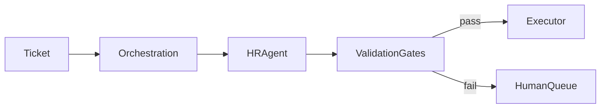

# Documentation Standards

> **Type:** Rule · **Owner:** Engineering · **Status:** Approved · **Applies to:** Dev Agent · All humans contributing code · **Jurisdiction:** Global · **Last reviewed:** 2026-05-15

## Summary

The Wiki is the source of truth for **rules, playbooks, and references**. This page defines the documentation that lives **outside** the Wiki — README files, API docs, runbooks, ADRs, architectural diagrams, and customer-facing docs — and how they relate back to the Wiki.

The principle: documentation that lives close to the thing it documents stays accurate longer.

---

## 1. Where each kind of documentation lives

| Kind | Lives in | Owner | Read by |
|---|---|---|---|
| Strategic plan, business context | Wiki (`Type: Context`) | Founders | Humans |
| Agent rules and playbooks | Wiki (`Type: Rule`, `Playbook`) | Domain Expert Councils + Engineering | Agents + humans |
| Reference data (entity model, glossary) | Wiki (`Type: Reference`) | Engineering | Agents + humans |
| Service operational README | Repo, alongside the service | Service owner | Engineers |
| API reference | Generated from OpenAPI | Engineering | Customers + integrators |
| Architecture Decision Records | Repo (`wiki/adrs/`) and Wiki | The decision proposer | Engineers + future readers |
| Runbooks | Repo (`runbooks/`) linked from alerts | On-call team | On-call engineers |
| Customer-facing product docs | Separate docs site | Product + Customer Success | Customers |
| Customer-facing API docs | Generated docs site | Engineering | Integrators |
| Internal onboarding (HR for our employees) | HR system | People team | Atlantis employees |

A useful prompt for "where does this belong?" — *will an agent ever consume this?* If yes, Wiki. If only humans, choose the location closest to what it describes.

## 2. Service README — minimum content

Every service repo has a `README.md` containing, in this order:

1. **One-line description** — what the service does
2. **Owner** — team or rotation responsible
3. **Status** — `alpha` / `beta` / `ga` / `deprecated`
4. **Quick start** — clone-to-running in under 5 commands
5. **Architecture** — link to ADRs and the Wiki [Architecture Principles](Architecture-Principles)
6. **APIs** — link to the OpenAPI spec
7. **Configuration** — list of env vars with descriptions
8. **Deployment** — link to deployment docs
9. **Runbooks** — links to runbooks (incident response paths)
10. **Tests** — how to run tests locally
11. **Contributing** — link to repo contribution guide

The Dev Agent uses the README structure as a template when scaffolding new services.

## 3. API documentation

- Source: OpenAPI 3.1 specs in the same repo as the implementation.
- Generated docs published to a customer-facing site.
- Every endpoint has: purpose, parameters, request example, response example, error codes, scopes required.
- Drift between code and spec is a PR-blocking lint failure (see [API Design Standards § 13](API-Design-Standards#13-openapi-31-specs-are-the-source-of-truth)).

## 4. Architecture Decision Records (ADRs)

We use the [Michael Nygard format](https://cognitect.com/blog/2011/11/15/documenting-architecture-decisions):

```
# ADR-NNN: <Title>

Date: YYYY-MM-DD
Status: Proposed | Accepted | Superseded by ADR-MMM | Deprecated

## Context
What's the situation that calls for a decision?

## Decision
What did we decide?

## Consequences
What follows from this decision (good and bad)?
```

Rules:

- ADRs are numbered sequentially across the platform.
- ADRs are **immutable** once accepted. To change a decision, write a new ADR that supersedes the old one.
- ADRs live in `wiki/adrs/<NNN>-<title>.md` and are visible in the Wiki.
- The Dev Agent reads ADRs relevant to any subsystem before working on it.

## 5. Runbooks

Every alert that pages a human has a runbook. The runbook contains, in order:

1. **What just happened** — what the alert means
2. **Immediate impact** — what the customer experience is
3. **Triage steps** — first 5 minutes
4. **Investigation** — what to check, in what order
5. **Mitigation** — how to stop the bleed
6. **Resolution** — root cause patterns and fixes
7. **Postmortem template link** — Sev1/2 requirements

Runbooks live with the service repo. The alert payload includes the runbook URL.

## 6. Architectural diagrams — C4 model

We use the [C4 model](https://c4model.com/) for architecture diagrams:

- **Level 1: Context** — Atlantis and its external actors
- **Level 2: Containers** — services, databases, queues
- **Level 3: Components** — inside a service
- **Level 4: Code** — class/module diagrams (rare; generated where useful)

Diagrams live as source-controlled `*.dsl` (Structurizr) or PlantUML. The rendered image is regenerated by CI on edit — diagrams never drift from source.

## 7. Customer-facing documentation

- Hosted at `https://docs.atlantis.os/` (separate from the marketing/pitch site).
- Authored by Product and Customer Success with engineering review.
- Versioned alongside the platform: docs for `v1.x` remain available even when `v2.x` is live.
- Code examples are real, tested, and pinned to library versions.
- Internationalisation: English at GA; additional languages by Phase 3 if customer demand emerges.

## 8. Internal team documentation (not in Wiki)

For documentation that humans need but agents do not — meeting notes, design sketches, onboarding for our own employees, etc. — use a shared doc tool (Notion / Confluence / Google Docs) per company policy.

This is **not** a place for rules, playbooks, or references — those go in the Wiki. If something in team docs starts to look like an agent-facing rule, promote it to the Wiki immediately.

## 9. Code comments policy

(See [Coding Standards § 5](Coding-Standards#5-comments).)

Documentation in code is for the *why*, not the *what*. Public APIs require docstrings; everything else defaults to no comment.

## 10. Diagrams in the Wiki

When a Wiki page needs a diagram:

- Use Mermaid syntax — GitHub Wiki and most renderers support it natively.
- Diagrams render inline; no separate image upload.
- Diagrams are part of the Wiki page's source — version-controlled like the rest.

Example:

````

````

## 11. Versioning of documentation

- Wiki: version-controlled via git; `Last reviewed` field per page.
- Service README and ADRs: versioned with the service repo.
- API docs: versioned per major API version.
- Customer-facing docs: snapshot per platform major version.

## 12. Forbidden

- Documentation in slide decks as primary source (decks are presentations, not docs).
- Word documents or PDFs as authoritative source.
- Screenshots of dashboards as documentation (use the live dashboard URL).
- "We discussed this in Slack" as a substitute for an ADR.
- README files that haven't been updated when the service changed substantively (PR check verifies).

---

## When to revisit

- A new audience for our documentation emerges (e.g. partners, system integrators) — define their docs surface.
- An incident retrospective traces to undocumented runbook or stale README.
- Customer support frequently asked questions reveal docs gaps.
- AI tooling for documentation generation reaches a maturity worth adopting — re-evaluate the boundary between human-written and generated.

---

## Cross-references

- [Wiki Conventions](Wiki-Conventions)
- [Wiki Governance](Wiki-Governance)
- [Coding Standards](Coding-Standards)
- [API Design Standards](API-Design-Standards)
- [Observability Standards](Observability-Standards)
- [Master Blueprint Index](Master-Blueprint-Index)
