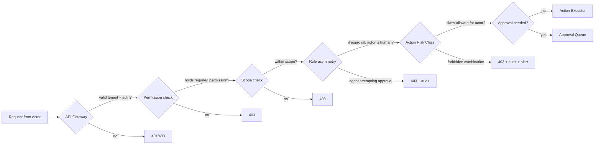

# Identity and Access Control

> **Type:** Blueprint · **Owner:** Security / CTO · **Status:** Approved · **Applies to:** All agents · All humans contributing code · **Jurisdiction:** Global · **Last reviewed:** 2026-05-17

## Summary

This page is the **spine of the platform**. It defines who can do what — for both AI agents and human employees — under one identity model. Every agent has a name, a title, a department, a manager, and a permission set, just like every human employee. The only intentional asymmetry is that **agents propose actions and humans approve them**. Everything else is symmetric.

The architecture of the [Control Center](Control-Center), the [Approval Workflow Framework](Approval-Workflow-Framework), the [Unified Ticketing System](Unified-Ticketing-Blueprint), and every audit trail in the platform rests on the model defined here. Without it, none of those work.

---

## 1. Why this page exists

The Atlantis wiki had already committed to a unified `actor_kind: {human, agent, system}` abstraction across [tickets](Unified-Entity-Model#ticket), [audit events](Unified-Entity-Model#audit-event), [telemetry](Observability-Standards), and the [Fleet View](Control-Center#31-fleet-view). What was missing was the identity record that the abstraction points at — an `Agent` entity to sit alongside `Employee`, a canonical `Role` object, a permission registry, and the lifecycle workflows that issue and rotate agent credentials.

Without those, the [Control Center](Control-Center#8-permissions-and-rbac) hand-waved at a "platform IAM" that did not exist; the [Approval Workflow Framework](Approval-Workflow-Framework) routed by role names without specifying where those roles came from; and the customer onboarding flow could not concretely answer the question *who is accountable when the HR Agent does the wrong thing?*

This page closes those gaps under one principle: **agents are first-class actors with the same identity shape as employees**. Different species, same contract.

---

## 2. The Actor model

Every entity that can take an action on the platform is an **Actor**. Three kinds exist:

| Kind | Examples | Can originate | Can be assignee | Can approve | Has credentials |
|---|---|---|---|---|---|
| **Person** | Employee, customer admin, contractor | ✓ | ✓ | ✓ | ✓ (SAML/OIDC + MFA) |
| **Agent** | HR Agent, Finance Agent, Dev Agent | ✓ | ✓ | ✗ (hard rule) | ✓ (short-lived JWT, scoped) |
| **Service** | Orchestration Engine, Action Executor, Universal Data Bridge | ✓ (system-originated tickets only) | ✗ | ✗ | ✓ (mTLS service identity) |

All three implement the same contract:

```
Actor {
  actor_id          string          // person:<uuid> | agent:<uuid> | service:<uuid>
  actor_kind        enum            // human | agent | system
  tenant_id         string          // every actor is tenant-scoped (§ 10)
  display_name      string          // "Sarah Chen", "HR Agent", "Orchestration Engine"
  role_title        string          // "HR Director", "HR Specialist (Agent)", "Internal Service"
  department        string | null   // canonical department name; null for cross-functional
  status            enum            // active | paused | quarantined | deprecated
  permissions       list<string>    // resolved from role bundle (§ 5)
  manager_actor_id  string | null   // accountability link (§ 3.2)
  created_at        datetime
  updated_at        datetime
}
```

This is the universal shape. Anything that produces an audit event, claims a ticket, or appears in the Fleet View is an Actor by this definition. Every downstream system (Approval Queue, Activity Log, Control Center, Trust Score) joins on `actor_id` against this single contract.

**The unifying claim of this page in one sentence:** *Agents are employees of a different species — same form, same accountability link, same supervision model, with the single hard asymmetry that they cannot approve.*

---

## 3. The Agent entity

### 3.1 Schema

`Agent` mirrors [Employee](Unified-Entity-Model#employee). Where Employee extends Person, Agent stands on its own — it is not a sub-type of Person, because an agent is not a human. But the *shape* parallels Employee deliberately so every downstream system can treat them the same way.

| Field | Type | Required | Notes |
|---|---|---|---|
| `id` | string | ✓ | `agent:<uuid>` |
| `tenant_id` | string | ✓ | Agents are tenant-scoped; Acme's HR Agent ≠ Initech's HR Agent |
| `display_name` | string | ✓ | Customer-visible name, e.g. `"HR Agent"` or `"Hiring Co-Pilot"` |
| `agent_family` | string | ✓ | Canonical family identifier: `hr_agent`, `finance_agent`, `legal_agent`, `sales_agent`, `marketing_agent`, `operations_agent`, `dev_agent` |
| `agent_version` | string | ✓ | Semantic version of the deployed agent build, e.g. `hr-agent-v3.1` |
| `role_title` | string | ✓ | The job title within the customer's org chart, e.g. `"HR Specialist"`, `"Junior Accountant"` |
| `role_level` | string | | Customer-defined band (parallels Employee.role_level) |
| `department` | string | ✓ | Canonical department; one of `HR`, `Finance`, `Legal`, `Sales`, `Marketing`, `Operations`, `Engineering`, or customer-defined |
| `manager_person_id` | string | ✓ | **FK to Person. Mandatory.** Every agent has a named human owner (§ 3.2). |
| `status` | enum | ✓ | `active` \| `paused` \| `quarantined` \| `deprecated` |
| `scopes_document_id` | string | ✓ | Reference to the [scope assignment doc](Action-Risk-Classification#scope-assignment) governing what this agent can call |
| `role_bundle_id` | string | ✓ | The Role this agent has been assigned (§ 4) |
| `model_routing_profile` | string | | AI model and prompt version this agent uses ([AI Model and Prompt Standards](AI-Model-and-Prompt-Standards)) |
| `trust_score_summary` | object | | Cached headline from [Trust Score](Control-Center#5-trust-score-specification) per ticket kind |
| `started_at` | datetime | ✓ | When this agent was activated for this tenant |
| `deprecated_at` | datetime | | When this agent was retired |
| `external_refs` | map<source, id> | | e.g. `{ "iam": "iam-record-uuid" }` |

The Agent record lives in the [Unified Entity Model](Unified-Entity-Model#agent) (added in the same change as this page) and is read-write by the platform IAM service only — never by another agent.

### 3.2 Every agent reports to a human

The `manager_person_id` field is **mandatory and non-nullable**. Every agent at every tenant has a named human owner. This is the single most important rule on this page.

Why mandatory:

- **Accountability.** When the HR Agent does the wrong thing, the platform pages a named person, not an inbox. Sarah Chen, Head of HR at Acme, is the human accountable for everything Acme's HR Agent does. Compliance auditors see her name in the audit trail.
- **Escalation.** [Approval workflow escalation](Approval-Workflow-Framework#6-expiry) needs a human at the top of every chain. The agent's manager is the default first-tier escalation when an action from this agent stalls.
- **Trust ratchet.** [Phased Autonomy progression](Phased-Autonomy-Reference) requires explicit human approval at each tier. The agent's manager is the default proposer of a phase ratchet for their agent.
- **Cultural framing.** An agent without a manager is a tool. An agent with a manager is a teammate. The wiki has consistently taken the second framing; this field makes it real.

If an agent's manager leaves the company, the offboarding workflow ([HR Agent Playbook](HR-Agent-Playbook)) **must reassign the agent's manager_person_id before deactivating the previous manager's account**. Agents must never be orphaned.

### 3.3 Agents are not Persons

An agent is not a sub-type of Person and does not have a Person record. Reasons:

- An agent has no `legal_name`, `jurisdiction`, or `emails` in the human sense.
- An agent has no employment contract; the platform–customer contract covers it.
- Treating agents as Persons would corrupt the human identity space (GDPR data-subject rights, payroll, employee benefits all assume Person = human).

The shared abstraction is `Actor`, not `Person`. The Audit Event, Ticket, and Control Center read `actor_id` and don't care which kind they joined to.

---

## 4. The Role object

A **Role** is a named bundle of permissions plus a scope constraint. Roles are how an Actor's `permissions[]` field gets populated; an actor does not hold raw permissions directly, only inherits them by holding one or more roles.

### 4.1 Schema

```
Role {
  id              string                // role:<uuid> for custom; role:default:<name> for canonical
  name            string                // "Department Manager", "HR Specialist (Agent)", "Finance Approver"
  description     string
  applies_to      enum                  // human | agent | both
  scope           enum                  // tenant | department | entity
  scope_value     string | null         // dept name when scope=department; entity_id when scope=entity
  permissions     list<permission_key>  // strings from the canonical registry (§ 5)
  inherits_from   list<role_id>         // role inheritance; cycles forbidden (§ 12)
  is_canonical    boolean               // true = ships in the wiki; false = tenant-defined
  tenant_id       string | null         // null for canonical; required for custom
  created_by      actor_id              // who defined this role
  created_at      datetime
  updated_at      datetime
}
```

### 4.2 Where roles live

- **Canonical role bundles** (the defaults — § 7) live in the wiki. They are platform invariants. Changing one requires a [Wiki Governance § 8](Wiki-Governance#8-conflict-between-wiki-and-code) decision plus a coordinated code change.
- **Custom roles** (tenant-specific) live in the **platform IAM database**. They are tenant configuration, not platform invariants. A customer's "Sales Engineering Lead" role is theirs to define and mutate.

This split honours the touchstone *"the Wiki is the source of truth"* — the wiki holds the rules, not every customer's per-tenant configuration. The wiki defines what a Role *is* (this section); the IAM DB stores what specific Roles individual tenants have defined.

The IAM service exposes a CRUD API for custom roles. Customer admins use it (via the Control Center settings surface); the API enforces every rule in this page.

### 4.3 Role inheritance

A custom role may inherit from one or more canonical roles or other custom roles. Resolution is straightforward: the actor's effective permission set is the union of all directly held roles' permissions plus the transitive closure of inherited permissions.

Cycles are rejected at insert time. Inheritance depth is capped at 5 to keep resolution cheap.

---

## 5. The canonical permission registry

Permissions are strings. The platform recognises exactly the strings listed here; any other string is rejected at every enforcement point. New permissions require this page to be updated.

### 5.1 Format

`<domain>.<action>[.<qualifier>]` — e.g. `ticket.approve.financial`, `agent.pause`, `compliance.export.signed`.

### 5.2 Registry

| Permission | What it grants | Enforced at |
|---|---|---|
| **Ticket lifecycle** | | |
| `ticket.read.self` | Read tickets where actor is originator / assignee / related | API gateway |
| `ticket.read.department` | Read all tickets in actor's department | API gateway |
| `ticket.read.tenant` | Read all tickets in the tenant | API gateway |
| `ticket.create` | Originate a new ticket | API gateway |
| `ticket.comment` | Add a comment audit event to a ticket | API gateway |
| `ticket.reassign.department` | Reassign a ticket within actor's department | API gateway |
| `ticket.reassign.tenant` | Reassign a ticket cross-department | API gateway |
| `ticket.cancel` | Cancel a ticket pre-execution | API gateway |
| **Approvals** | | |
| `ticket.approve.low` | Approve `Write/low` and `External/templated` actions | Approval Queue |
| `ticket.approve.medium` | Approve `Write/medium` actions | Approval Queue |
| `ticket.approve.high` | Approve `Write/high` actions | Approval Queue |
| `ticket.approve.financial` | Approve `Financial` actions (CFO delegate) | Approval Queue |
| `ticket.approve.delete` | Approve `Delete` actions | Approval Queue |
| `ticket.approve.external` | Approve `External/free_form` actions | Approval Queue |
| **Rollback** | | |
| `ticket.rollback.own_department` | Roll back a closed ticket within actor's department, within retention | Action Executor |
| `ticket.rollback.tenant` | Roll back any closed ticket in the tenant | Action Executor |
| `ticket.supersede` | Create a corrective ticket linked to a past-retention or irreversible action | API gateway |
| **Control Center surfaces** | | |
| `control_center.fleet_view` | See the Fleet View grid | Control Center |
| `control_center.cross_dept_read` | View tickets across departments (beyond own) | Control Center |
| `control_center.trust_score.read` | View Trust Score panels | Control Center |
| `control_center.activity_log.read` | Read the Activity Log | Control Center |
| **Emergency controls (customer admin)** | | |
| `agent.pause` | Pause new ticket assignment to an agent | Control Center |
| `agent.quarantine` | Pause + revoke credentials + open forensic ticket | Control Center |
| `tenant.emergency_revert_window` | Roll back all actions by a named actor across a time window | Control Center |
| **Compliance** | | |
| `compliance.export.read` | Generate compliance-grade export artifacts | API gateway |
| `compliance.export.signed` | Generate signed, timestamped export bundles (legal evidentiary use) | API gateway |
| **Identity admin (customer admin)** | | |
| `iam.role.read` | Read custom role definitions | IAM service |
| `iam.role.write` | Create / modify custom roles | IAM service |
| `iam.actor.read` | Read actor records (Person, Agent) | IAM service |
| `iam.actor.write` | Modify actor records (e.g. assign role, change manager) | IAM service |
| `iam.agent.provision` | Activate a new agent for the tenant | IAM service |
| `iam.agent.deprovision` | Retire an agent for the tenant | IAM service |
| **Phase progression** | | |
| `phase.ratchet.propose` | Propose ratcheting an agent's autonomy phase | Approval Queue |
| `phase.ratchet.approve` | Approve a phase ratchet (customer admin or exec sponsor) | Approval Queue |

### 5.3 Adding to the registry

Adding a new permission requires:

1. A PR updating this section (Wiki Governance review).
2. Coordinated update to every enforcement point listed (API gateway, Approval Queue, IAM service, Control Center, Action Executor).
3. An entry in the [Wiki Governance § 8](Wiki-Governance) coordinated-change ledger.

Permissions cannot be added solely in tenant configuration. Only the platform vocabulary grows; tenant customisation combines existing permissions into roles.

---

## 6. The asymmetry that stays

Agents **cannot** be approvers. This is a hard rule, not a configuration. Three reasons:

- **Causal accountability.** The audit trail must end at a human's decision for compliance, legal liability, and regulatory clarity. An agent approving an agent has no human in the loop; that is the failure mode this entire architecture is designed to prevent.
- **Game-theoretic safety.** Agents acting under their own optimisation pressure could collude (intentionally or as a property of shared training data) to approve each other into unsafe states. A human checkpoint breaks the loop.
- **The Trust Score depends on it.** The Trust Score's *human-override rate* input ([Control Center § 5.2](Control-Center#52-inputs)) only has meaning if humans are reviewing agent proposals. If agents approved agents, there would be no override signal.

Concretely, this asymmetry is enforced as:

- The `applies_to: human | agent | both` field on every Role. A Role with `applies_to: agent` cannot include any `ticket.approve.*` permission. The IAM service rejects role definitions that violate this at write time.
- The Approval Queue enforces at routing time: an approval routed to a role with no human members produces a `gate_failure_review` ticket — the workflow halts rather than proceeding through agents.
- The `agent.pause`, `agent.quarantine`, `tenant.emergency_revert_window`, and `phase.ratchet.approve` permissions are explicitly `human`-only (enforced at the Control Center).

Everything else is symmetric. Agents can:

- Originate tickets (`ticket.create`).
- Be assigned tickets (`ticket.reassign.department`).
- Read tickets within their scope (`ticket.read.*`).
- Propose actions (the default verb for an agent).
- Be commented on, audited, evaluated, promoted, demoted, retired.

In short: agents are first-class teammates — except they cannot be the buck-stops-here human in an approval chain.

---

## 7. Default role bundles (canonical)

These ship in the wiki and apply to every tenant out of the box. Customers can add custom roles (§ 8) but cannot remove or mutate the canonical defaults.

### 7.1 Human roles

| Role | Applies to | Scope | Key permissions |
|---|---|---|---|
| **Employee** | human | self | `ticket.read.self`, `ticket.create`, `ticket.comment`, `control_center.activity_log.read` (filtered to own work) |
| **Department Manager** | human | department | Employee's + `ticket.read.department`, `ticket.approve.low`, `ticket.approve.medium`, `ticket.reassign.department`, `ticket.rollback.own_department`, `control_center.trust_score.read` (dept), `phase.ratchet.propose` |
| **Department Head / Exec** | human | department | Department Manager's + `ticket.approve.high`, `ticket.approve.external`, `phase.ratchet.approve` (dept-scoped) |
| **Finance Approver** | human | tenant | `ticket.approve.financial`, `ticket.approve.delete`, `ticket.read.tenant` (financial entities only) |
| **Compliance Reviewer** | human | tenant | `ticket.read.tenant`, `control_center.activity_log.read`, `compliance.export.signed` — and nothing that mutates state |
| **Customer Admin** | human | tenant | All of Department Manager + `ticket.read.tenant`, `ticket.approve.high`, `ticket.rollback.tenant`, `agent.pause`, `agent.quarantine`, `tenant.emergency_revert_window`, `iam.*` |

### 7.2 Agent roles

Each canonical agent family ships with a default role bundle. Customers may override `role_title` and `manager_person_id` per tenant but cannot grant permissions outside the family's allowed set.

| Role | Applies to | Scope | Allowed permission classes |
|---|---|---|---|
| **HR Agent** | agent | department=HR | `ticket.read.department`, `ticket.create`, `ticket.comment`, `ticket.reassign.department` — plus scopes per [Action Risk § Scope assignment](Action-Risk-Classification#scope-assignment) for HR-only sources |
| **Finance Agent** | agent | department=Finance | Same shape; Finance-only sources |
| **Legal Agent** | agent | department=Legal | Same shape; Legal-only sources |
| **Sales Agent** | agent | department=Sales | Same shape; Sales/Marketing sources only |
| **Marketing Agent** | agent | department=Marketing | Same shape; Marketing/external comms sources |
| **Operations Agent** | agent | department=Operations | Same shape; Operations/Vendor sources |
| **Dev Agent** | agent | department=Engineering | Same shape; code/CI/deploy sources; never HR/Finance/Legal scopes ([Action Risk § Forbidden combinations](Action-Risk-Classification#forbidden-combinations)) |
| **Orchestration Service** | system | tenant | `ticket.create` (system-originated only), `ticket.read.tenant` — no approval, no rollback |

No canonical agent role contains any `ticket.approve.*` permission. This is forbidden by § 6.

### 7.3 Default agent role_title naming

When a customer activates an agent family at onboarding, the default `role_title` is `"<Department> Specialist (Agent)"` — e.g. `"HR Specialist (Agent)"`. The "(Agent)" suffix is preserved in any export, audit log, or org-chart rendering so that a reader can never confuse an agent's action for a human's.

Customers may rename the agent (e.g. `"Hiring Co-Pilot"`) but the IAM service appends the canonical suffix in any compliance-grade output.

---

## 8. Custom roles (tenant-specific, in the IAM database)

Customer admins create custom roles via the IAM API for organisational fit. The IAM service is the system of record for these.

### 8.1 Creation flow

```
1. Customer admin opens Control Center → Settings → Roles → New Role
2. Names the role, selects applies_to (human | agent | both)
3. Selects permissions from the canonical registry (§ 5)
4. Optionally selects parent role(s) to inherit from (§ 4.3)
5. IAM service validates:
   - All permission keys exist in the canonical registry
   - applies_to=agent does not include any ticket.approve.* permission
   - No inheritance cycle
   - Depth ≤ 5
6. Role record written to IAM DB; audit event emitted (actor_kind=human, action_class=Write, target=role:<id>)
7. Role becomes assignable to actors in the tenant
```

### 8.2 Assignment flow

Assigning an actor a role is itself an action under the standard governance:

- `iam.actor.write` permission required (Customer Admin only by default).
- An audit event is emitted (`actor.role.granted` / `actor.role.revoked`).
- Originator cannot grant themselves a role they don't already hold (no privilege escalation by self-grant).
- Adding `compliance.*` permissions to any role triggers a dual-control confirmation per [Approval Workflow § 9](Approval-Workflow-Framework#9-approval-impersonation).

### 8.3 IAM DB constraints

The IAM database enforces at the schema level:

- `tenant_id` is a required FK on every role and assignment record.
- A role with `is_canonical=true` cannot be inserted by tenant API calls.
- Soft-delete only; revoked roles are retained for 7 years for audit reconstruction.

---

## 9. Agent lifecycle

The lifecycle of an agent is the sequence of state transitions on its `status` field plus the workflows that produce them.

### 9.1 Provisioning

1. Customer admin (or the [AI Business Consultant Onboarding](AI-Business-Consultant-Onboarding) flow) initiates provisioning for an agent family (e.g. HR Agent).
2. The provisioning ticket asks: `display_name`, `role_title`, `manager_person_id`, target autonomy phase.
3. **`manager_person_id` is required.** The flow blocks until a named human is selected.
4. The IAM service:
   - Creates an `Agent` record with `status=active`, `agent_version` = latest stable
   - Issues a scoped credential (short-lived JWT bound to the agent_id)
   - Writes the scopes document per the role bundle for that family
   - Emits an `agent.provisioned` audit event
5. The agent appears in the [Fleet View](Control-Center#31-fleet-view) immediately.

### 9.2 Versioning (agent upgrades)

Agent versions deploy via the [Dev Agent](Dev-Agent-Playbook) and `deployment` ticket workflow. When `hr-agent-v3.1` is promoted to stable:

- The old `Agent` record's `agent_version` field is updated in place; identity is preserved (same `agent_id`).
- The historical action log remains attributed to the same `agent_id`; the version field on each audit event lets compliance distinguish which build did what.
- The Trust Score history is **partitioned** at the version boundary by default — the new version starts a new evaluation cohort, with the old history visible for context. Customers can choose to carry over (with a documented compliance attestation).

### 9.3 Rotation

Agent credentials (JWTs) are short-lived (≤1 hour per [Action Risk Classification § Time-bounded scope grants](Action-Risk-Classification#time-bounded-scope-grants)). Rotation happens automatically as part of every task issuance; no manual rotation is required.

If a credential is compromised, the agent's `status` is set to `quarantined`; all in-flight tokens are revoked; the credential mint is paused; an `incident_response` ticket is opened ([Incident Response Playbook](Incident-Response-Playbook)).

### 9.4 Pause / Quarantine / Reactivation

- `pause` — temporary halt to new ticket assignment. In-flight tickets continue or transition to `blocked`. Reversible by any Customer Admin.
- `quarantine` — pause + immediate credential revocation + opens a forensic `gate_failure_review` parent ticket. Requires dual-admin confirmation to reverse.
- `deprecate` — terminal state. Agent identity retained for audit forever; no new tickets assigned. The display_name is suffixed with "(Deprecated)" in every UI.

### 9.5 Manager reassignment

When the agent's `manager_person_id` (a human) leaves the company:

1. The HR Agent's offboarding workflow detects the impending termination of that human.
2. Every agent whose `manager_person_id` matches is enumerated.
3. A `manager_reassignment` ticket is opened **before** the human's termination ticket can close.
4. The new manager must be named (Customer Admin or interim Department Head).
5. Only after reassignment can the original manager's `Employee.employment_status` transition to `terminated`.

This is the rule that prevents orphaned agents. It is enforced as a ticket dependency in the offboarding saga ([Cross-Agent Coordination § 9](Cross-Agent-Coordination#9-saga-pattern-for-cross-entity-workflows)).

### 9.6 Deprovisioning

Triggered by Customer Admin via `iam.agent.deprovision`. Workflow:

1. Confirm there are no `in_progress` or `awaiting_approval` tickets owned by this agent.
2. Reassign any open tickets to a substitute agent or a human.
3. Set `status=deprecated`, `deprecated_at=now`.
4. Revoke all credentials.
5. Trust Score history preserved for compliance retention window.

---

## 10. Multi-tenancy and isolation

Agents are tenant-scoped. There is no global "HR Agent" identity; there is a *separate* `Agent` record per tenant, even though they may share the same `agent_family` and `agent_version`.

Consequences:

- Acme's HR Agent and Initech's HR Agent have different `agent_id` values, different scopes documents, different role assignments, different Trust Scores, and different managers.
- A platform-wide agent code change (deploying `hr-agent-v3.2`) updates the build all tenants run, but each tenant's `Agent` record retains its own identity, history, and configuration.
- Cross-tenant scopes are **forbidden**. The IAM service rejects any role whose scope_value crosses tenant boundaries.
- Multi-tenancy enforcement happens at four points: API gateway (every request carries `tenant_id`), IAM service (writes blocked outside tenant), Action Executor (queries scoped by `tenant_id`), and audit log (every event tagged).

This is what makes the BYOC story tractable: an entire tenant — its actors, roles, audit history, scopes — can be physically isolated in the customer's cloud, because there is no shared identity state with other tenants.

---

## 11. Permission enforcement points

A request flows through these checks. A failure at any point short-circuits the request with a structured error.



Five enforcement points, each owned by a distinct service:

1. **API Gateway** — authenticates the actor, resolves the tenant, checks the permission key against the actor's resolved permission set (from the role bundle).
2. **Scope check** — for permissions with `scope=department` or `scope=entity`, validates that the target resource is within the actor's scope.
3. **Role asymmetry** — for any `ticket.approve.*` or `iam.*` write, validates the actor is `actor_kind=human`. Agents are blocked here.
4. **Action Risk Classification** — applies the [forbidden combinations](Action-Risk-Classification#forbidden-combinations) table.
5. **Approval Queue / Action Executor** — final routing per the [Approval Workflow Framework](Approval-Workflow-Framework).

Each failure is audited with the failed check name. Sustained failure rates feed the [Observability Standards § alerting](Observability-Standards#6-alerting) — a burst of permission denials may indicate misconfiguration, compromise, or a runaway agent.

---

## 12. Forbidden

- **Agent approving anything.** Hard rule; cannot be configured.
- **Orphaned agents.** An agent cannot exist without a `manager_person_id`. Enforced at every Agent write.
- **Cross-tenant scopes.** Roles cannot span tenants. Enforced at IAM write.
- **Self-grant of unheld permissions.** An actor cannot grant themselves a permission they don't already hold.
- **Removing canonical roles.** The seven canonical agent role bundles and six canonical human role bundles cannot be deleted or mutated by tenant operations.
- **Hard-coded permission strings outside the registry.** No service may check a permission key not listed in § 5.
- **Role inheritance cycles.** Rejected at IAM write.
- **Persistent agent credentials.** No agent credential lives longer than 1 hour; rotation is mandatory.
- **Shared credentials between human and agent.** No actor identity may be reused across kinds.
- **Bypassing the IAM service for role writes.** Direct DB writes to the role or assignment tables are forbidden; the IAM API is the only write path.

---

## 13. Performance envelope

These reads are on the platform-level IAM service. They feed the [SLOs in Observability Standards](Observability-Standards#2-service-level-objectives-slos).

| Operation | p50 | p95 | p99 |
|---|---|---|---|
| Permission check (cached) | < 1ms | < 5ms | < 15ms |
| Permission check (cold) | < 20ms | < 60ms | < 150ms |
| Role resolution (with inheritance) | < 30ms | < 100ms | < 250ms |
| Agent provisioning (full workflow) | < 5s | < 15s | < 30s |
| Role write | < 50ms | < 150ms | < 400ms |
| Actor lookup by ID | < 5ms | < 20ms | < 50ms |

Permission checks are aggressively cached; cache invalidation is event-driven (any role or assignment write invalidates the relevant actor's cache entries within 500ms).

---

## 14. When to revisit

- A customer requests an agent that can approve. Re-read § 6. The answer is no. If the request persists, the right move is to make the human approval lightweight (templated approval, batched approval) — never to weaken the asymmetry.
- The canonical permission registry (§ 5) grows past ~50 entries — consider a hierarchy or namespace re-design.
- The IAM DB stores more than ~1000 custom roles per tenant on average — the customer's role design is probably too granular; revisit with them.
- A new agent family is introduced (e.g. an eighth department) — add its canonical role bundle to § 7.2 and its allowed scopes to [Action Risk Classification § Scope assignment](Action-Risk-Classification#scope-assignment).
- The role inheritance depth limit (5) is hit by a real customer — review their org structure before raising the limit; depth > 5 usually indicates a design smell.
- A regulator or auditor requests an identity attestation we cannot produce from this model — the model is missing something; add it here before shipping the attestation.

CTO is the accountable owner. Security owns the IAM service. Each Domain Expert Council owns the role bundle for its department. Wiki Governance reviews every permission-registry change.

---

## Cross-references

- [Control Center](Control-Center) — the surface that consumes this identity model
- [Unified Entity Model § Agent](Unified-Entity-Model#agent) — the agent entity schema
- [Unified Entity Model § Role](Unified-Entity-Model#role) — the role entity schema
- [Approval Workflow Framework](Approval-Workflow-Framework) — the asymmetry-respecting approval routing
- [Action Risk Classification](Action-Risk-Classification) — the scope/action-class authorisation framework
- [Security and Data Policy § 4](Security-and-Data-Policy#4-identity-and-access-management) — the IAM policy posture
- [Architecture Principles § 9](Architecture-Principles#9-multi-tenancy-first) and [§ 10](Architecture-Principles#10-zero-trust-between-services) — the multi-tenancy and zero-trust principles this builds on
- [Phased Autonomy Reference](Phased-Autonomy-Reference) — the phase ratchet uses this page's role bundles
- [AI Business Consultant Onboarding](AI-Business-Consultant-Onboarding) — the customer onboarding that provisions the first agents
- [HR Agent Playbook](HR-Agent-Playbook) — the offboarding workflow that protects against orphaned agents
- [Wiki Governance](Wiki-Governance) — the change-control process for the canonical registry and role bundles
- [The Six Barriers § B4](The-Six-Barriers#b4--agent-identity--security) — the strategic argument for this page
- [Master Blueprint Index](Master-Blueprint-Index)
