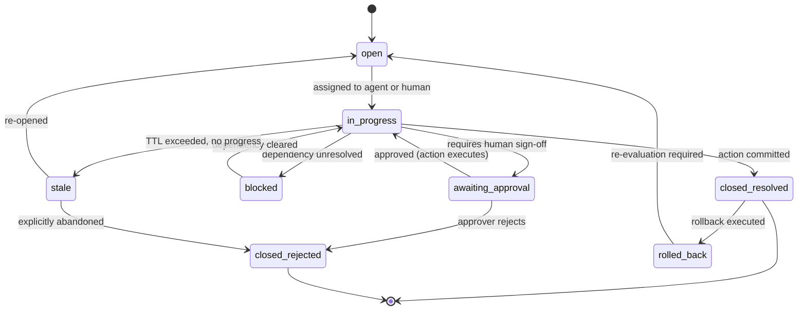

# Unified Ticketing Blueprint

> **Type:** Blueprint · **Owner:** Engineering / CTO · **Status:** Approved · **Applies to:** All agents · All humans contributing code · **Jurisdiction:** Global · **Last reviewed:** 2026-05-16

## Summary

The **Unified Ticketing System** is the second foundational substrate of Atlantis (the other is the [Unified CRM Blueprint](Unified-CRM-Blueprint)). It is **the single work substrate for every action in the platform** — every agent action, every human approval, every cross-department workflow, every code commit, every campaign launch, every expense decision, every hire, every fix.

If the Unified CRM is *what the business knows*, the Unified Ticketing System is *what the business does about it*. Every department's day-to-day operation flows through it.

This is **structurally different from every existing enterprise** today. Most companies operate three to seven disconnected ticketing systems:

| Today (fragmented) | Atlantis (unified) |
|---|---|
| Jira / Linear — engineering tickets | One Ticket store |
| Zendesk / Intercom — customer support tickets | Same store |
| ServiceNow — IT and operations tickets | Same store |
| Asana / Monday — marketing campaign tickets | Same store |
| Coupa — procurement / vendor approval | Same store |
| Greenhouse / Lever — hiring pipeline | Same store |
| Email + spreadsheets — Finance / Legal / HR | Same store |

The fragmentation in the left column is **the consequence of every department buying its own SaaS tool**. Because Atlantis owns the agent runtime across every department, the work substrate has to be unified — otherwise we lose the single property that makes the platform work: **every action is visible in one audit trail, governed by one approval framework, and executable through one Action Executor.**

> **This page is the blueprint.** The wire-level schema for the Ticket entity lives in [Unified Entity Model § Ticket](Unified-Entity-Model#ticket). The Action Executor that processes ticket-derived mutations is specified in [Cross-Agent Coordination](Cross-Agent-Coordination). The human approval machinery a ticket may invoke is specified in [Approval Workflow Framework](Approval-Workflow-Framework). This page defines *what a ticket is, why ticketing must be unified, the ticket lifecycle, the taxonomy, and how each department uses tickets all day.*

---

## 1. What "ticket" means in Atlantis

A ticket is **a unit of work the platform commits to track from origination to resolution**. Not every action is a ticket — a single agent read is not. But every action that:

- Changes state in the [Unified CRM](Unified-CRM-Blueprint), **or**
- Affects something outside the platform (an email, a payment, a deployment, a hire), **or**
- Requires a human decision, **or**
- Involves more than one agent, **or**
- Carries a risk tier above `Read` ([Action Risk Classification](Action-Risk-Classification))

…is a ticket.

This includes the obvious cases (a support request, a bug fix, an expense approval) **and the cases most companies do not track as tickets today**:

- A marketing email going out → ticket.
- A renewal email going out → ticket.
- A code deployment → ticket.
- A vendor invoice approval → ticket.
- An offer letter being drafted → ticket.
- A wiki page being updated → ticket.
- An NDA being signed → ticket.

The discipline is uniform: **every meaningful action creates a ticket, every ticket creates audit events, every audit event is permanent.** This is what makes the [Trust Score Dashboard](The-Six-Barriers#b5--trust--change-management) calculable in the first place — and what makes [B1 (compound failure)](The-Six-Barriers#b1--compound-failure) recoverable: every step is named, addressable, and rollback-anchored.

---

## 2. Why this is one of a kind

The fragmentation table at the top is not an accident; it is the consequence of every vendor solving a single workflow. Atlassian built Jira for engineers; it would be a clumsy tool for HR. Zendesk built a help-desk; it would be a clumsy tool for procurement. **No vendor can collapse them because no vendor owns the cross-department agents.**

Atlantis does. Three properties follow:

- **One lifecycle, one state machine.** A renewal ticket, a bug ticket, and a hiring ticket all transition through the same states (§ 3) and are visible in the same console. A customer's COO can see "every ticket in motion across every department right now" in one query.
- **One approval framework.** A finance approval, an HR approval, and a code-deployment approval all use the [Approval Workflow Framework](Approval-Workflow-Framework). Routing rules differ by ticket kind; the machinery does not.
- **One audit trail.** Every ticket transition is an audit event ([Unified Entity Model § Audit Event](Unified-Entity-Model#audit-event)). Compliance asks "show me everything that happened to Acme Corp last quarter" and gets a single chronological export across departments.

Existing tools cannot do this because they were never asked to. A Jira ticket and a Zendesk ticket live in different schemas, different state machines, different audit logs, different approver pools. Stitching them is what enterprise integration teams spend years on. Atlantis does not stitch — there is one substrate.

Strategically, this is the same argument as the [Unified CRM Blueprint § 2](Unified-CRM-Blueprint#2-why-this-is-one-of-a-kind): we can build it because we own the agent runtime, and we *must* build it because the agent runtime fails without it.

---

## 3. The ticket lifecycle

Every ticket transitions through this state machine. There are no department-specific lifecycles — only ticket-kind-specific routing within the same lifecycle.



State semantics:

| State | Meaning | Who can transition out |
|---|---|---|
| `open` | Created, not yet picked up | Orchestration Engine (assigns), human (picks up) |
| `in_progress` | Agent or human is actively working | The assignee (or system on timeout) |
| `awaiting_approval` | Action proposed; sitting in [approval queue](Approval-Workflow-Framework) | Approver |
| `blocked` | Cannot progress until a dependency clears | Orchestration Engine (auto-unblock on event) |
| `closed_resolved` | Action committed via Action Executor | — (terminal; only `rolled_back` can revive) |
| `closed_rejected` | Discarded — rejected, expired, or abandoned | — (terminal) |
| `stale` | Past TTL without resolution | Orchestration Engine or human |
| `rolled_back` | Previously committed, then reverted | Re-routed to `open` for re-evaluation |

Every transition is an [Audit Event](Unified-Entity-Model#audit-event). The audit trail of a ticket *is* its history; there is no separate "ticket history" table.

---

## 4. Ticket taxonomy

A ticket's `kind` field determines its routing, validation gates, approval rules, and SLA. Kinds are organised into families:

### 4.1 Customer-lifecycle tickets (Sales, Marketing, Customer Success)

| Kind | Originator | Default assignee | Typical risk tier |
|---|---|---|---|
| `lead_enrichment` | Marketing Agent / inbound form | Sales Agent | `Write/low` |
| `lead_qualification` | Sales Agent | Sales Agent | `Write/medium` |
| `sales_outreach` | Sales Agent | Sales Agent (auto), human approver for free-form | `External/templated` or `External/free_form` |
| `proposal_draft` | Sales Agent | Sales Agent + human approver | `Write/medium` |
| `contract_review` | Sales Agent | Legal Agent | `Write/high` |
| `renewal_planning` | Sales Agent | Sales Agent | `Write/medium` |
| `churn_intervention` | Sales Agent / triggered by usage signal | Sales Agent + CSM | `Write/medium` |
| `marketing_campaign` | Marketing Agent | Marketing Agent | `External/free_form` |
| `support_ticket` *(mirrored from external help-desk)* | external system / Customer Success Agent | Support team | varies |

### 4.2 Employee-lifecycle tickets (HR)

| Kind | Originator | Default assignee | Typical risk tier |
|---|---|---|---|
| `hire_request` | Hiring manager | HR Agent | `Write/high` |
| `offer_draft` | HR Agent | HR + Finance + Legal (saga) | `Write/high` |
| `onboarding_workflow` | HR Agent | HR Agent (parent of child tickets) | varies |
| `compensation_change` | HR Agent / Finance Agent | HR + Finance (saga) | `Write/high` + `Financial` |
| `role_change` | HR Agent | HR Agent | `Write/high` |
| `leave_request` | Employee | HR Agent | `Write/medium` |
| `performance_review` | HR Agent | HR + manager | `Write/medium` |
| `policy_question` | Employee | HR Agent | `Read` |
| `termination` | HR Agent | HR + Legal + Finance (saga) | `Delete` + `Financial` |

### 4.3 Financial tickets (Finance)

| Kind | Originator | Default assignee | Typical risk tier |
|---|---|---|---|
| `expense_review` | Employee / Finance Agent | Finance Agent + approver | `Financial` |
| `invoice_issuance` | Finance Agent | Finance Agent + human approver | `Financial` |
| `invoice_review` | Finance Agent | Finance Agent + approver | `Write/high` |
| `payment_run` | Finance Agent (scheduled) | Finance Agent + CFO delegate | `Financial` |
| `refund` | Finance Agent | Finance Agent + approver | `Financial` |
| `journal_entry` | Finance Agent | Finance Agent | `Write/high` |
| `financial_report` | Finance Agent | Finance Agent (read-heavy) | `Read` |
| `budget_review` | Finance Agent | Finance Agent + department head | `Write/medium` |

### 4.4 Operations & vendor tickets (Operations)

| Kind | Originator | Default assignee | Typical risk tier |
|---|---|---|---|
| `vendor_onboarding` | Operations Agent | Operations + Legal + Finance | `Write/medium` |
| `vendor_review` | Operations Agent | Operations Agent | `Write/medium` |
| `procurement_request` | Employee | Operations + Finance | `Financial` |
| `project_kickoff` | Operations Agent | Operations Agent | `Write/medium` |
| `meeting_summary` | Operations Agent | Operations Agent | `Write/low` |
| `resource_planning` | Operations Agent | Operations + HR | `Write/medium` |

### 4.5 Legal tickets (Legal)

| Kind | Originator | Default assignee | Typical risk tier |
|---|---|---|---|
| `contract_drafting` | Legal Agent / Sales / Operations | Legal Agent + human counsel for high-risk | `Write/high` |
| `compliance_review` | Legal Agent (scheduled) / triggered | Legal Agent | `Read` then `Write/high` |
| `policy_update` | Legal Agent | Legal Agent + Wiki Governance | `Write/high` |
| `regulatory_filing` | Legal Agent | Legal Agent + human counsel | `External/free_form` |
| `dispute_escalation` | Any | Legal + executive | varies |

### 4.6 Engineering tickets (Dev)

| Kind | Originator | Default assignee | Typical risk tier |
|---|---|---|---|
| `feature_request` | any agent or human | Dev Agent | `Write/medium` |
| `bug_fix` | any agent or human | Dev Agent | `Write/medium` |
| `connector_build` | Sales / Operations (mid-deal) | Dev Agent | `Write/medium` |
| `connector_drift_repair` | Universal Data Bridge (auto) | Dev Agent | `Write/medium` |
| `code_review` | Dev Agent | Code Review Agent + human reviewer | `Write/medium` |
| `deployment` | Dev Agent | Dev Agent + Release Approver | `Write/high` |
| `incident_response` | Observability (auto-paged) | Dev / on-call | varies; often `Write/high` |
| `wiki_update` | any agent | Wiki Governance approver | `Write/medium` |

### 4.7 Platform-internal tickets

| Kind | Originator | Default assignee | Typical risk tier |
|---|---|---|---|
| `merge_persons` | Universal Data Bridge | human admin | `Write/high` |
| `gate_failure_review` | Validation gate (auto) | originating agent + human reviewer | `Read` |
| `version_conflict` | Action Executor (auto) | originating agent | `Read` |
| `cost_budget_alert` | [Runaway Prevention](Runaway-Prevention-and-Cost-Controls) | FinOps approver | `Read` |
| `prompt_injection_quarantine` | [Prompt Injection Defence](Prompt-Injection-Defence-and-Secret-Protection) | Security on-call | `Read` |

This list is **canonical** — new kinds require a [Wiki Governance § 8](Wiki-Governance) decision plus a corresponding entry in the [Approval Workflow Framework](Approval-Workflow-Framework) routing rules.

---

## 5. Ticket → Action: the connection to the Action Executor

A ticket is **a unit of work**; an action is **a single mutation**. The relationship is one-to-many: a ticket produces one or more actions, executed via the [Action Executor](Cross-Agent-Coordination#3-the-action-executor).

```mermaid
flowchart LR
    H[Human or signal] -->|creates| T[Ticket: open]
    T -->|assigned to| A[Agent]
    A -->|reasons + validates| P[Proposed action(s)]
    P -->|validation gates| G{All gates pass?}
    G -->|no| FB[Gate-failure-review ticket]
    G -->|yes, low-risk| AQ[Action Queue]
    G -->|yes, needs approval| AP[Approval Queue]
    AP -->|approver decides| AQ
    AQ -->|FIFO per entity| AX[Action Executor]
    AX -->|commit + emit| DB[(CRM)]
    AX -->|audit event| AE[Audit Log]
    AE -->|update| T2[Ticket: closed_resolved]
```

The ticket is the **stable handle** the customer sees and the audit trail is attached to. The actions are the granular mutations the platform executes. **One ticket, many actions, one audit story.**

This is also where the [validation gates](Validation-Gate-Specifications) live. Gates run on proposed actions *before* they leave the agent. A failed gate produces a `gate_failure_review` child ticket (taxonomy § 4.7) routed to a human for diagnosis — never silently dropped.

---

## 6. How tickets link entities

Tickets are first-class edges in the CRM graph ([Unified CRM Blueprint § 8](Unified-CRM-Blueprint#8-the-relationship-graph)). Every ticket carries:

- `related_entity_ids: list<entity_id>` — every entity the ticket reads from or writes to.
- `parent_ticket_id: string | null` — for saga child tickets.
- `child_ticket_ids: list<string>` — for saga parents.
- `dependency_ticket_ids: list<string>` — for `blocked` state.

A renewal-planning ticket against Acme Corp typically relates to:

- `Customer:cust:acme`
- `Contract:contract:acme-msa-v3`
- The `Person` records for the Acme decision-makers
- The historical `Transaction` records (payment history)
- Past `Ticket` records (support history, expansion conversations)

The customer admin's view of "everything happening with Acme right now" is a single graph traversal: customer → tickets where status in (`open`, `in_progress`, `awaiting_approval`).

---

## 7. Cross-department workflows: ticket sagas

A workflow that touches multiple departments is a **parent ticket** with **child tickets**, executed as a [saga](Cross-Agent-Coordination#9-saga-pattern-for-cross-entity-workflows).

Example — the **promotion saga** (already specified in Cross-Agent Coordination):

```
Parent ticket: role_change#42 (HR)
  ├─ Child: role_update#42a (HR — Employee.role_title write)
  ├─ Child: compensation_change#42b (Finance — Compensation write + Financial approval)
  └─ Child: announcement_email#42c (Marketing — External/templated)

Saga rules:
- Child tickets execute in declared order.
- If any child fails, compensating actions run in reverse for committed children.
- Parent reaches closed_resolved only when every child reaches closed_resolved.
- A single saga audit-event chain links the parent and all children.
```

Other recurring sagas:

- **Hire-to-onboard:** `hire_request` (HR) → `offer_draft` (HR + Legal review + Finance budget check) → `background_check` (HR + Legal) → `onboarding_workflow` (HR + Operations + Dev — for engineering hires, accounts + dev environment).
- **Quote-to-cash:** `proposal_draft` (Sales) → `contract_review` (Legal) → `customer_record_creation` (Sales + Operations) → `invoice_issuance` (Finance).
- **Vendor activation:** `vendor_onboarding` (Operations) → `contract_drafting` (Legal) → `vendor_record_creation` (Operations + Finance) → `procurement_request` (Operations + Finance).
- **Customer-driven feature:** `feature_request` (Sales / customer admin) → `connector_build` or `wiki_update` (Dev) → `deployment` (Dev) → notification back to the originating ticket.

Saga durability: a platform restart resumes the saga from its last committed child ticket (per [Cross-Agent Coordination § 9](Cross-Agent-Coordination#9-saga-pattern-for-cross-entity-workflows)). Customers never see "partially completed promotion" state — only `in_progress` or `closed_resolved` at the parent level.

---

## 8. External system mirroring

Customers do not abandon their existing tools on day one (or ever, in many cases). Atlantis tickets **mirror to and from** the customer's existing systems via the [Universal Data Bridge](Product-Requirements):

| External system | Atlantis ticket kinds mirrored | Direction |
|---|---|---|
| Jira / Linear | `bug_fix`, `feature_request`, engineering subtasks | Two-way |
| GitHub Issues / GitLab Issues | `bug_fix`, `feature_request`, `code_review` | Two-way |
| Zendesk / Intercom / Front | `support_ticket` | Two-way |
| ServiceNow | IT and ops tickets | Two-way |
| Greenhouse / Lever | `hire_request`, candidate stages | Two-way |
| Coupa / Ironclad | `procurement_request`, `vendor_onboarding`, `contract_drafting` | Two-way |
| Slack / Teams | Ticket *notifications* (not full mirror) | Outbound |
| Email | Inbound ticket *creation* via parsed inboxes (e.g. `support@`) | Inbound |

Two-way sync semantics:

- Updates from the external system arrive as [Universal Data Bridge](Product-Requirements) events and apply to the Atlantis ticket as a normal write (through the Action Executor).
- Updates from Atlantis push back to the external system. Status mappings (e.g. Atlantis `awaiting_approval` → Jira "In Review") are configured per tenant in the Wiki.
- **Conflict policy** is the same as for CRM data ([Unified CRM Blueprint § 5.2](Unified-CRM-Blueprint#52-universal-data-bridge-sync-external-sources)) — per-field source-of-truth designation, ambiguous merges routed to humans.

This is what makes the unified ticketing system **adoptable rather than disruptive**. A Jira-using engineering team does not have to change tools to benefit; they keep using Jira and the Dev Agent works alongside them in the same ticket. Over time, the Atlantis console becomes the cross-department superset; the per-department tools remain the working surfaces where teams prefer them.

---

## 9. Per-department day-to-day

How each department's work flows through tickets in normal operation.

### HR Agent — a typical day

1. Inbound `policy_question` from an employee (US) — answers from the US employment-law wiki page, `closed_resolved` in seconds.
2. `hire_request` arrives from a hiring manager — opens a saga: `offer_draft` → Legal review → Finance budget check → background check → `onboarding_workflow`.
3. `leave_request` from a UK employee — applies UK statutory leave rules, drafts approval ticket routed to the employee's manager.
4. Scheduled `performance_review` cycle kicks off — creates one ticket per employee, assigned to their manager.

### Finance Agent — a typical day

1. Morning `payment_run` — Finance Agent reviews queued vendor invoices, proposes payments. Each is a `Financial` ticket requiring a CFO-delegate approver per the [Approval Workflow Framework](Approval-Workflow-Framework).
2. `expense_review` queue — Finance Agent reviews submitted expenses against policy; clean ones are templated approvals, ambiguous ones go to the finance approver.
3. `invoice_issuance` for renewing customers — generated from the Sales Agent's `renewal_planning` ticket, approved by the finance approver.
4. End-of-day `financial_report` — read-only ticket producing the daily P&L view.

### Sales Agent — a typical day

1. Inbound `lead_qualification` tickets from the website / event imports.
2. `sales_outreach` tickets for qualified leads — templated emails ship under autonomy; free-form drafts go to the AE for sign-off.
3. `renewal_planning` for customers within 90 days of contract end — opens a saga involving Legal (contract review) and Finance (proposal numbers).
4. `churn_intervention` triggered by a usage drop — pulls the customer graph, drafts an outreach plan, routes to the CSM.

### Marketing Agent — a typical day

1. `marketing_campaign` ticket — drafts the brief, segments the audience from the CRM, drafts the assets, submits for review.
2. Campaign outputs (email sends, social posts) are `External` tickets that require approver sign-off for free-form content and execute under autonomy for templated.
3. `lead_enrichment` against new inbound contacts.

### Legal Agent — a typical day

1. `contract_review` from Sales — applies the customer's standard MSA + addenda playbook, marks deviations, routes high-risk redlines to human counsel.
2. Scheduled `compliance_review` cycles — quarterly GDPR / SOC 2 / DPA reviews.
3. `policy_update` tickets when regulations change — drafts wiki updates that route through Wiki Governance.

### Operations Agent — a typical day

1. `vendor_onboarding` flow — sage with Legal and Finance.
2. `meeting_summary` tickets from connected calendars — drafts summaries with action items, each action item becomes its own ticket if state-changing.
3. `resource_planning` tickets for staffing customer implementations.
4. `procurement_request` tickets from any department, routed for Finance approval.

### Dev Agent — a typical day

1. `feature_request` tickets from customer admins (via the console) or from internal teams.
2. `bug_fix` tickets from `incident_response`, customer support, or Observability auto-page.
3. `connector_drift_repair` tickets auto-opened when the Universal Data Bridge detects a schema change in an external API.
4. `deployment` tickets bundling completed PRs into a release, gated by Release Approver.
5. `wiki_update` tickets when the Dev Agent's work changes a documented behaviour.

**Every one of these crosses the same Ticket schema, the same Action Executor, the same audit log.** A platform engineer can answer "what did the agents do last week" with a single query.

---

## 10. Phased Autonomy applied to tickets

[Phased Autonomy](Phased-Autonomy-Reference) governs how much of the ticket's work the agent does autonomously vs. how much waits for a human.

| Phase | What happens at ticket level |
|---|---|
| **Drafting** | Agents create draft ticket content (assignments, descriptions, proposed actions). Every action requires a human to approve before execution. No `closed_resolved` without explicit human approval. |
| **Startup** | Read-class actions execute autonomously. Write-low actions execute autonomously. Write-medium, Write-high, External, Financial, Delete still require approval. |
| **Approval** | Read + Write-low + Write-medium autonomous. External-templated autonomous. Write-high, External-free-form, Financial, Delete still approval-gated. |
| **Enterprise** | Read + most Write + External-templated autonomous. Financial and Delete **always** require human approval (hard rule, see [Action Risk Classification](Action-Risk-Classification)). High-stakes Write tiers may be policy-auto-approved per tenant config. |

A tenant can ratchet **up** the autonomy phase per ticket kind, never down silently. Phase transitions are tracked in the [Trust Score Dashboard](The-Six-Barriers#b5--trust--change-management) — the customer sees "you moved HR from Drafting to Startup 47 days ago; here is the evidence."

---

## 11. SLAs and TTLs

Every ticket has:

- A `priority` (low | normal | high | urgent) set at creation, adjustable on escalation.
- A `due_at` derived from the customer's per-kind SLA configuration.
- A `ttl` for the `awaiting_approval` state (per [Approval Workflow Framework § 6](Approval-Workflow-Framework#6-expiry)).
- A `stale_after` for the `in_progress` state without progress events.

Default SLAs (per priority, configurable per tenant):

| Priority | First-touch | Resolution target |
|---|---|---|
| `urgent` | 15 minutes | 4 hours |
| `high` | 2 hours | 24 hours |
| `normal` | 24 hours | 5 business days |
| `low` | 5 business days | 30 days |

SLA breaches feed [Observability Standards](Observability-Standards) — sustained breach rate per kind indicates either understaffing on the human side, an autonomy phase that's too low, or routing miscalibration.

---

## 12. Audit trail

The ticket *is* the audit trail. Every state transition, assignment change, approval, comment, and linked action is an [Audit Event](Unified-Entity-Model#audit-event) with the ticket ID as `workflow_id`.

A compliance-grade export for a single ticket includes:

- Origination (who/what created it, with timestamp).
- All state transitions with actor identity (human or agent), timestamp, and reason.
- All proposed actions and their gate results.
- All approval decisions with approver identity, action (`approve` / `approve_with_edits` / `reject` / `defer`), and rationale.
- The committed action payloads (before/after diffs) from the Action Executor.
- Any rollback events with rollback approver identity and reason.

A compliance-grade export for a **customer** is the union of all their tickets. A compliance-grade export for a **department** is the union of all tickets where any related entity is owned by that department per the [ownership matrix](Unified-CRM-Blueprint#4-departmental-ownership-matrix).

This is what makes a SOC 2 / ISO 27001 / GDPR audit a query, not a project.

---

## 13. The customer-facing console

Customers interact with the Unified Ticketing System through three primary surfaces:

1. **My Work** — every ticket assigned to me, or awaiting my approval. The default landing view for a logged-in employee.
2. **Department View** — every ticket in a department (HR, Finance, etc.), filterable by status, priority, kind, assignee.
3. **Entity View** — every ticket related to a given entity (Acme Corp, Sarah Chen, Q3 2026 campaign). This is the graph traversal of § 6.

A fourth view, **Trust Score Dashboard**, is the cross-department aggregate — accuracy, override rate, gate failure rate, SLA performance per agent per ticket kind. This is the boardroom-ready surface ([Strategic Considerations](Strategic-Considerations#the-trust-score-is-the-sales-tool)).

The console never lets a user write directly to a ticket without it producing an audit event. Comments are audit events. Re-assignments are audit events. Closing a ticket is an audit event.

---

## 14. Mapped to the six barriers

| Barrier | How the Unified Ticketing System addresses it |
|---|---|
| **B1 — Compound failure** | The ticket / action separation gives us per-step audit, per-step gates, per-step rollback. A failure at step 3 of an 8-step saga rolls back cleanly; the parent ticket reflects the state. |
| **B2 — Domain expertise gap** | Ticket-kind routing rules embed the Domain Expert Councils' knowledge (a `compensation_change` goes through Finance + HR approval per US/EU jurisdiction). |
| **B3 — Data silos** | Tickets are edges in the CRM graph (§ 6). Two-way mirroring (§ 8) collapses the day-to-day fragmentation between Jira / Zendesk / ServiceNow / etc. without forcing tool migration. |
| **B4 — Agent identity & security** | Every ticket carries the originating and assignee agent identities. Approval workflows enforce that the human who created a ticket cannot approve it ([Approval Workflow Framework § 9](Approval-Workflow-Framework#9-approval-impersonation)). |
| **B5 — Trust & change management** | The Trust Score Dashboard is calculated from ticket lifecycle data. Phased Autonomy is operationalised per ticket kind (§ 10). Customers see, per ticket, why the agent did what it did. |
| **B6 — Breadth complexity** | One state machine, one schema, one approval framework across all seven departments. Adding the eighth department adds new ticket kinds, not a new ticketing system. |

---

## 15. Performance envelope

Ticket-level operations on the platform-level Ticketing service. These feed the [SLOs in Observability Standards](Observability-Standards#2-service-level-objectives-slos).

| Operation | p50 | p95 | p99 |
|---|---|---|---|
| Ticket create | < 50ms | < 150ms | < 400ms |
| Ticket read by ID | < 20ms | < 60ms | < 150ms |
| State transition | < 80ms | < 200ms | < 500ms |
| List query (1 department, 100 tickets) | < 100ms | < 300ms | < 800ms |
| Graph query (entity → tickets, depth=1) | < 80ms | < 200ms | < 600ms |
| Saga child enqueue | < 50ms | < 150ms | < 400ms |

Throughput target: 5K tickets/sec/cell sustained creation; 20K state transitions/sec/cell sustained. These shape the [Technology Stack](Technology-Stack) queue and database sizing.

---

## 16. Forbidden

- Creating a ticket without `kind`, `originator_kind`, `originator_id`, `priority`, and at least one `related_entity_id` (rejected at API gateway).
- Bypassing the ticket lifecycle — every state-changing customer action must produce a ticket.
- Closing a ticket without an associated terminal action or explicit rejection (no "silent close").
- Approving a ticket you originated as a human ([Approval Workflow Framework § 9](Approval-Workflow-Framework#9-approval-impersonation)).
- Bulk-closing tickets without per-ticket rationale (audit log must explain each).
- Mirroring an external ticket without designating the source-of-truth direction per field.
- Adding a new ticket `kind` without an Approval Workflow routing rule and a Validation Gate spec.
- Holding a ticket in `in_progress` for longer than `stale_after` without an audit-logged progress event.

---

## 17. When to revisit

- A class of customer incidents traces to a missing ticket kind — promote it from ad-hoc to canonical (§ 4).
- Sustained SLA breach rate above 10% for a kind — re-evaluate autonomy phase, routing, or staffing.
- Two-way mirroring with an external system produces sustained conflict — re-evaluate the source-of-truth designation for that system / field.
- A new department (eighth, ninth) is added — extend the kind taxonomy and the approval routing rules.
- Throughput exceeds 4K tickets/sec/cell sustained — re-evaluate queue partitioning and database sizing.
- The state machine ever needs a new terminal state — likely an indicator of a missing abstraction in the audit model; review carefully.

CTO is the accountable owner. Engineering owns the Ticketing service's roadmap. Each Domain Expert Council owns the routing rules for its department's ticket kinds.

---

## Cross-references

- [Unified CRM Blueprint](Unified-CRM-Blueprint) — the other foundation
- [Unified Entity Model § Ticket](Unified-Entity-Model#ticket) — wire-level schema
- [Cross-Agent Coordination](Cross-Agent-Coordination) — Action Executor, queue, sagas, OCC
- [Approval Workflow Framework](Approval-Workflow-Framework) — approval routing, escalation, impersonation rules
- [Action Risk Classification](Action-Risk-Classification) — class and tier definitions used in `risk_tier`
- [Validation Gate Specifications](Validation-Gate-Specifications) — gates run on every proposed action
- [Phased Autonomy Reference](Phased-Autonomy-Reference) — what executes vs. what is queued per phase
- [Rollback Procedures](Rollback-Procedures) — rolling back from `closed_resolved` to `rolled_back`
- [Observability Standards](Observability-Standards) — SLOs and golden signals on ticket flow
- [Architecture Principles](Architecture-Principles)
- [The Six Barriers](The-Six-Barriers)
- [Product Requirements § H — Unified Ticketing System](Product-Requirements)
- [Master Blueprint Index](Master-Blueprint-Index)
